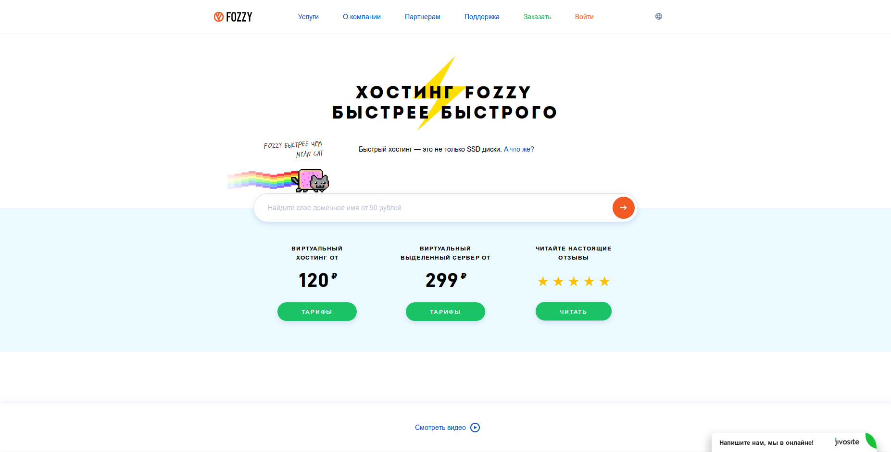

Да-да, вы не ослышались. Вот эта платежка за данный сайт пришла мне вчера утром, аж на целых $0,16! Я чуть со стула не упал.

Но почему и как складывается эта цена? Всё просто. Амазон списывает лишь по факту использования и для небольших хобби-проектов хостинг получается практически даром. Здесь правда следует сделать уточнение:

**Это касается в основном статических сайтов** (то есть расположенных на [AWS Amplify](https://aws.amazon.com/ru/amplify/), [AWS S3](https://aws.amazon.com/ru/s3/) и т.д.) Облачные же VPS, такие как AWS EC2 или AWS Lightsail зачастую дешевыми никак не назовешь. 

## Пример расчета стоимости

У вас есть личный кулинарный блог с 10 тысячами посетителей в месяц. И каждый из них просматривает одну страницу сайта. Размер запрашиваемой страницы - 1,5 Мб. Итого - 10.000 × (1,5 / 1024) =  14.6 гигабайт трафика.

Цена одного гигабайта: $0,15. **Итоговая стоимость: 14,6 * 0,15 = $2,19!!**

Вау! 140 рублей за посещаемый сайт — это очень даже неплохо, согласитесь. Любой более-менее приличный хостинг для вордпресса начинается где-то от 100 до 200 рублей в месяц. При этом, на традиционном хостинге сумма фиксирована и не меняется. Вне зависимости от того, заходят ли пользователи на ваш сайт или нет.

 

Вроде не такая уж и большая сумма. Но время идёт и авторы теряют интерес к своему сайту. А платить всё равно приходится, как ни крути! В годовом исчислении это несколько тысяч, выброшенных на ветер. Здесь же вы практически ничего не платите, если на сайте нет посетителей.    

## Статические сайты!? А как же WordPress?

В последнее время статические сайты переживают бум. Такие генераторы как [Gatsby](http://gatsbyjs.org/), [Next.js](https://nextjs.org), [Hugo](https://gohugo.io/), [Hexo](https://hexo.io/ru/), [Jekyll](https://jekyllrb.com/) и многие другие, набирают всё большую популярность. По функциональности они сейчас почти вплотную приблизились к вордпрессу. 

  

Им не нужна база данных, кеширование, наличие последней версии PHP и ещё бог знает что. Но в то же время они умеют практически всё, что нужно блогу. В том числе разбивать записи по категориям/тегам, искать по сайту (с помощью lunr) или добавлять комментарии (disqus).

## Альтернатива — Github Pages 

Совсем бесплатно сайт можно размещать на Github Pages. Но здесь есть несколько "но". Во-первых, тогда не будет поддержки SSL. А во-вторых, нет автоматической сборки, а значит сайт придется генерировать перед загрузкой на хостинг. И в-третьих, не самая быстрая скорость + кеширование всего на 10 минут.

AWS гораздо гибче в плане настройки + всё автоматизировано.

## Заключение

Надеюсь, статья была полезной. Открывайте свои блоги. Пишите о том, что вам нравится — о рыбалке, шахматах, кулинарии, да о чем угодно. Мне кажется, AWS Amplify + статический сайт представляет собой идеальное сочетание для хобби-проектов и блогов. Остается только осваивать разметку Markdown, да отвыкать потихоньку от вордпресса.

В следующих статьях я постараюсь подробнее остановиться на статических веб-сайтах. Желаю хорошего настроения 🙂              
