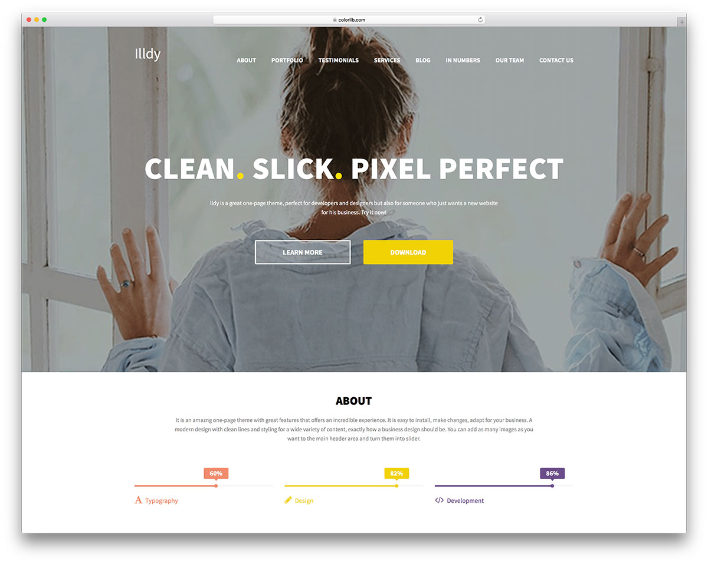
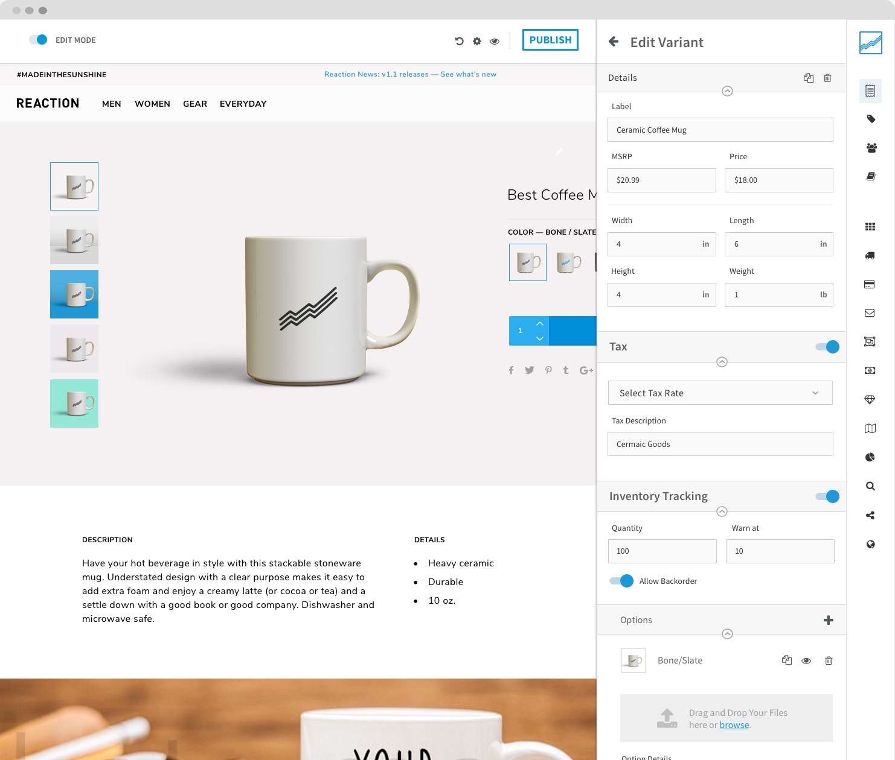

Хотите открыть интернет-магазин, но не знаете какую CMS выбрать? Сегодня мы попробуем в этом разобраться.

Сам по себе выбор платформы для магазина — это ответственный шаг. Однажды наполнив магазин сотней-другой продуктов, будет сложно от него отказаться и перейти на что-то другое. Поэтому выбирайте с умом.

Здесь следует уточнить, не всегда хорошая CMS = простая. Приходится идти на компромис, за простоту в использовании платить качеством. И наоборот, за качество жертвовать простотой. Мой совет, при выборе исходите из своих возможностей.

Итак, поехали.   

## 1. [PrestaShop](https://www.prestashop.com/)

### Чем хороша?

Преста представляет собой идеальный баланс. Она дружественна к новичкам, имеет большое количество настроек, быстро работает, качественно сделана, под неё большой выбор платных дополнений и около 6.000 тем. Плюс, не требовательна к ресурсам, практически любой хостинг подойдет.

### Чем плоха?

Дорогие дополнения. Если много установить, то они влетят в копеечку. 

## 2. [WooCommerce](https://woocommerce.com/)

### Чем хорош?

Вукоммерс — де-факто самая популярная платформа для интернет-магазинов на данный момент. Стабильный, простой в использовании, с огромным количеством дополнений. Практически всё, что вашей душе угодно можно купить или скачать. Не требователен к хостингу. Хорошие возможности по ведению блога.  

Имеет смысл использовать, если вы планируете быстро и не заморачиваясь открыть магазин. Можно буквально купить тему за $50, наполнить товарами и магазин готов. 

### Чем плох?

Отсутствуют некоторые базовые функции, такие как например смена фотографий товара при выборе другого цвета. Проблему можно решить установкой плагина, но уже за деньги. Не самая быстрая система. Утомительно добавлять товары, большое количество ненужных/раздражающих настроек. 

## 3. [Reaction Commerce](https://www.reactioncommerce.com/)

Один из самых амбициозных проектов последних лет. Использованы последние технологии в веб-разработке, такие как React, GraphQL, событийно-ориентированная архитектура. По количеству звезд на GitHub'е проект уже опередил Magento, WooCommerce, PrestaShop и OpenCart.

По скорости работы и набору уникальных возможностей превосходит другие решения. Маркетологи оценят аналитические возможности.

Минус — продукт пока ещё сырой, мало готовых решений.

### Кому подойдёт?

Опытным предпринимателям, у кого были интернет-магазины до этого. Для тех, кто не боится трудностей, у кого есть возможность и желание разрабатывать магазин практически с нуля. Или при наличии большого бюджета/команды программистов. 

## 4. [Magento](https://magento.com)

Я долго думал, включать ли magento в этот список или не включать. Система весьма противоречивая, но всё же заслуживает упоминания.

### Чем хорош?

Популярная система. Безумное количество настроек и встроенных функций. Настраивается практически все — валюты, языки, скидки, купоны, отчеты и многое другое. Огромное количество дополнений и готовых дизайнов. Подойдет для больших и сложных магазинов.     

### Чем плох?

Огромный, прожорливый монстр, требующий хорошего хостинга. Для небольшого магазина такое обилие функций не к чему. Очень дорогие дополнения и дорогое обслуживание. В среднем $100-500 за простое дополнение, а если это все перевести на рубли, то владельца ИП хватит инфаркт.   
