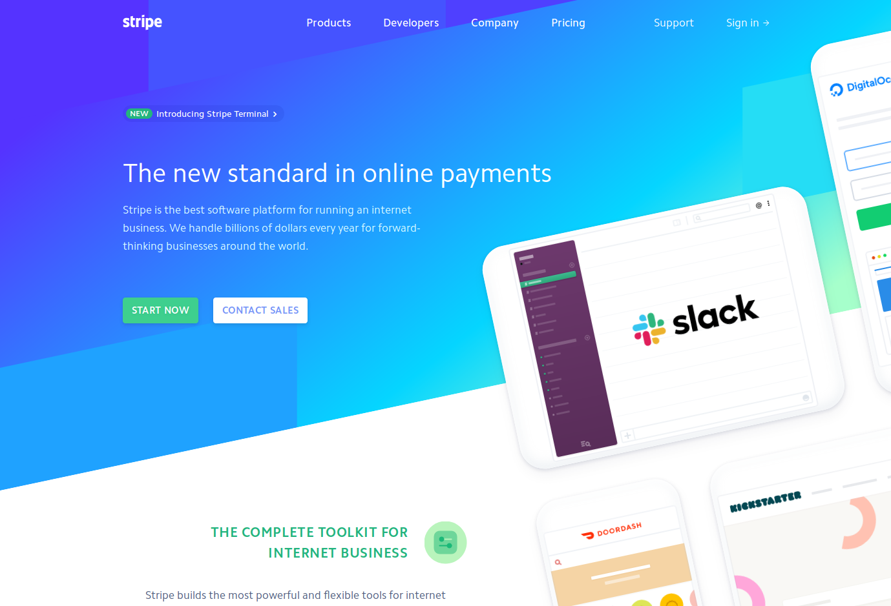
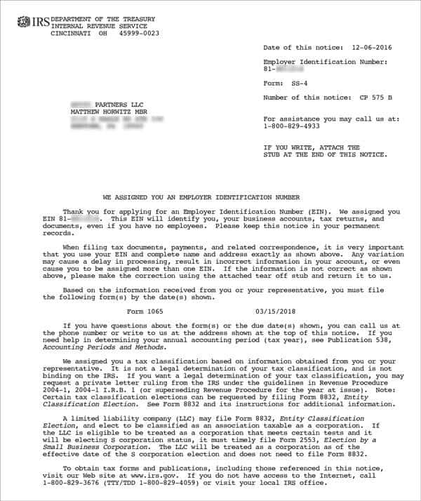
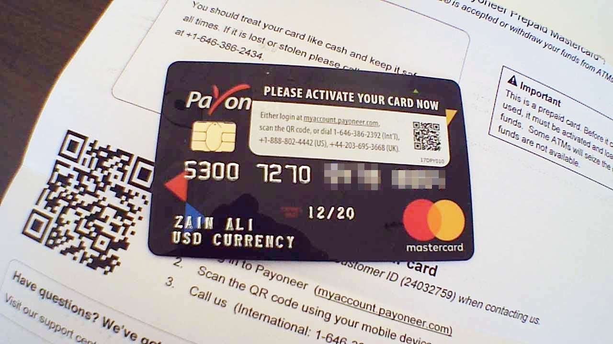
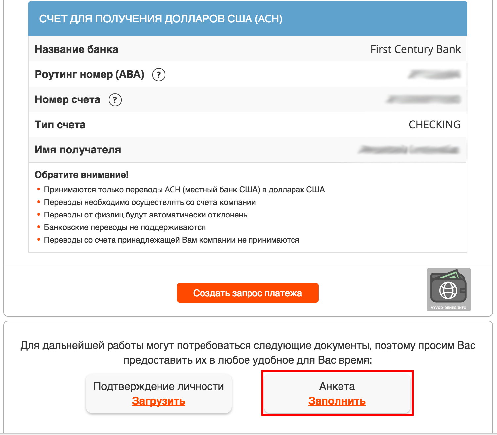

Открытие интернет-магазина в США — довольно сложная тема, со множеством подводных камней. Главная проблема, с которой столкнется любой иностранец, открывающий онлайн-бизнес в Америке — это отсутствие американского гражданства. Ни в рунете, ни в англоязычном сегменте нет внятной информация по этой теме. Я сам собирал информацию по крупицам несколько месяцев, так что можно сказать, что материал уникальный.

Прежде чем приступить к оформлению документов, учтите, что сайт должен быть **наполнен продуктами и выглядеть завершенным!** Также на сайте должны присутствовать 3 документа: 
-   _«**Политика возврата товаров и денежных средств**» (Return and Refund Policy)_. Здесь все понятно. Интересный факт, согласно исследованию TrueShip, более 60% покупателей изучают этот документ перед тем как совершить покупку.     
-   _«**Политика конфиденциальности**» (Privacy Policy)_. По закому, каждый магазин собирающий персональные данные (например e-mail, имя и фамилию) **обязан** иметь этот документ на своем сайте. В нем вы информируете пользователей, какие данные собираются и как они используются.
-   _«**Условия предоставления услуг**» (Terms and Conditions)_. Не обязательно, но желательно. Это правила, которые должны соблюдать пользователи, регистрируясь на вашем сайте. 

*Замечание:* каждый штат имеет свою политику относительно возвратов. А в Великобритании покупатель имеет право вернуть товар и получить деньги в течении 14 дней, не объясняя причин возврата.

---

## Получение платежей с помощью [Stripe](https://stripe.com/)

Этот способ является предпочтительным, потому что он самый быстрый и простой. Stripe пользуется большой популярностью во всем мире и это одно из главных его преимуществ. Он позволяет принимать платежи по всему миру, поддерживается 23 страны. Но к сожалению, Россия не входит в их число. Открыть аккаунт можно лишь оформив её на Американскую фирму.  

Stripe представляет из себя платежный агрегатор, главное отличие между полноценным _merchant account_ и агрегатором в том, что в первом случае на ваше имя открывается отдельный банковский счет. А во-втором, у всех продавцов один общий счет в банке. Получение _merchant account_ значительно сложнее и может занимать порядка 3-х недель.

Следующим шагом является **открытие компании в США**.

### Вопрос: можно ли открыть платежный шлюз на физическое лицо?
  
Нет, нельзя. Так как иностранцу, проживающему в другой стране нельзя предъявить иск или взыскать с него налоги. Хотя в России в редких случая получать платежи на физическое лицо можно (как пример [Робокасса](https://www.robokassa.ru/)). Открывая компанию, вы открываете для себя множество возможностей. Можно брать кредит от имени компании, оформлять банковский счет на компанию и многое другое.

Открыть компанию в США можно с помощью онлайн сервисов [MaxFillings](https://www.maxfilings.com/), [MyCompanyWorks](https://www.mycompanyworks.com/), [MyCorporation](https://www.mycorporation.com), [Incorporate Fast](https://www.incorporatefast.com) и других. Перед вами будет стоять выбор — открыть C Corporation или LLC. S Corporation иностранец открыть не может, это только для граждан США.

Основное отличие корпораций от LLC это форма организации. В корпорациях, собственность определяется процентом владения акций. В LLC же нет акционеров и нет акций, но есть процент владения компанией. LLC чуточку легче в плане бумажной волокиты, меньше бюрократии. Но с другой стороны, корпорация может существовать вечно, даже после смерти её акционера. Выбор остается за вами.

### Вопрос: во сколько это обойдётся?

В среднем, $200-500 за открытие компании. И далее, около $100-150 ежегодно за ведение документов, пошлина штату за заполнение налоговой декларации. Стоимость варьируется в зависимости от штата, самый дорогой штат — Массачусетс ($520 пошлина за регистрацию LLC/затем по $520 ежегодно, $295 за регистрацию корпорации). 

**Важный момент**: не забудьте включить услугу получения EIN и «Registered Agent». EIN будет использоваться далее при открытии банковского счета и получении платежного шлюза. А зарегистрированный агент — это способ общения с правительством, он получает различные юридические и налоговое документы от лица компании. При отсутствии зарегистрированного агента компания будет административно распущена и для восстановления работы придется заплатить дополнительную пошлину (около $100).

После оформления заказа, вы получите все документы и инструкции по почте. Требуется провести организационное собрание, выпустить акции и отправить форму SS-4 по почте или факсу в налоговую США. И дождаться получения письма подтверждения о присвоении номера EIN, оно будет выглядеть примерно вот так:

После получения номера, открытие компании можно считать завершенным.

## Открытие банковского счета

Следующей проблемой является получение банковского счета. Дело в том, что «Патриотический Акт» запрещает иностранцам открывать банковские счета через интернет. Нужно физически прилететь в США, придти в отделение банка с документами на компанию и там вам откроют счет.

Но не всё так плохо! Можно зарегистрировать по ссылке аккаунт [Payoneer](
https://share.payoneer.com/nav/G1BDzZRsOezktifdBBXXyIDZ0iaXOZFVgOk4hb3eRftQ5CLvSbsSd-wbP0xWVrJ5vuZgEa2hmtvcI001b9-WTA2
) и тогда у вас банковский аккаунт, с привязанной дебитовой картой. Выглядит она вот так:

 

Её пришлют по почте примерно через месяц. Этой картой можно пользоваться для расчетов с поставщиками, оплаты рекламы. Если вы планируете продавать на Amazon, карту Payoneer можно также использовать для получения вырученных от продажи товара средств. Реквизиты банковского счета находятся в личном кабинете, раздел _Receive → Global Payment Service_. Там вы увидите примерно такую таблицу:

Поздравляю, теперь у вас есть банковский счет!

**Примечание**: Payoneer подойдет для начала, но потом желательно все же слетать в США и оформить банковский счет на имя компании во избежании проблем с налоговой.

## Активация аккаунта Stripe  

К этому моменту у вас должно быть все готово — сайт, компания и банковский счет. Нужно зарегистрироваться [по этой ссылке](https://dashboard.stripe.com/register) и затем выбрать «Activate», где вы заполните всю необходимую информацию.

### Секция Owner

Когда вам предложат ввести домашний адрес можно [сгенерировать фейковый адрес](https://www.randomlists.com/random-addresses), либо воспользоваться сервисом аренды почтового адреса (таким как [VirtualPostmail](https://www.virtualpostmail.com/)). Внимание! Если вы решите арендовать почтовый адрес, имейте в виду, что аренда требует подписания формы USPS 1583 и нотариального подтверждения по вебкамере (стоит $80).

В поле Social Security number впишите просто 0000.

После отправки заявки, ваш аккаунт быстро активируют. Вот собственно и всё, в этом видео показывается дальнейшая настройка WooCommerce. Удачных продаж!  

<iframe width="560" height="315" src="https://www.youtube-nocookie.com/embed/pgru-VoINoY" frameborder="0" allow="accelerometer; autoplay; encrypted-media; gyroscope; picture-in-picture" allowfullscreen></iframe>

## Ответы на вопросы

### Вопрос: могу ли я использовать PayPal вместо Stripe?

Да, но тогда компанию придется регистрировать в России. Если у тебя российский паспорт, пейпал не даст зарегистрировать бизнес-аккаунт на американскую фирму. Минусов такого подхода несколько:

1. Многие поставщики требуют EIN и вряд ли будут работать с физлицом.
2. Пейпал часто [блокирует без видимой на то причины](https://medium.com/@puntofisso/paypal-closed-my-account-with-no-explanation-it-could-happen-to-you-6ff0ba4ea95f).
3. У некоторых покупателей нет PayPal, они путаются, когда хотят оплатить картой.
4. У пейпала плохая техподдержка.
 
### Вопрос: какие ещё есть варианты?

Вариантов несколько. Кроме Stripe есть PayPal (см. выше), 2Checkout (огромное количество плохих отзывов), потенциально ещё Braintree (если арендовать адрес в США), Amazon Pay, Adyen (для серьезного бизнеса) и разная экзотика вроде BitPay. Но я их не пробовал.

### Вопрос: может ли российский платежный шлюз принимать платежи от американцев?

Обычно нет. Трансграничные платежи запрещены, можно в индивидуальном порядке обсудить получение платежей из-за рубежа. Если это обосновать, то можно получить квоту (например не более 2% зарубежных плажетей).  

### Вопрос: что такое SSN и где его достать?

Social Security number — это что-то вроде номера паспорта. Иностранцу достать его практически нереально. Но если вы не боитесь трудностей, тогда устраивайтесь на работу в США и вам выдадут SSN. Гораздо легче получить ITIN (упрощенную версию SSN), подача заявки и рассмотрение займут около 5-6 недель. ITIN можно использовать вместо SSN, по нему оформят счет в банке или выдадут merchant account.   
