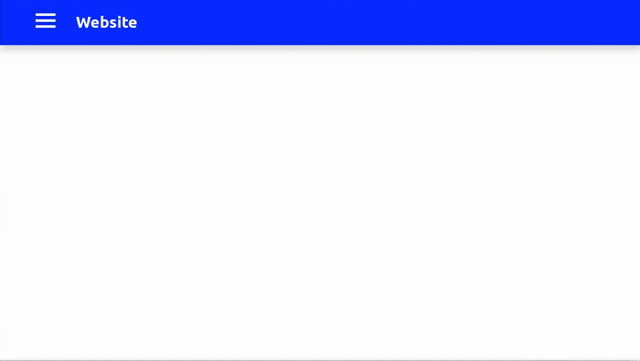

Все знают кнопку-гамбургер, правильно? Знаменитые три полоски, позволяющие спрятать меню за экраном. Оно особенно востребовано на мобильных устройствах, где дорог каждый пиксель пустого пространства.

Нравится ли вам или нет, но гамбургер меню используется и будет использоваться ещё какое-то время. Проблема в том, как его реализовать на React'е? Конечно, всё выглядит просто и понятно, но есть множество тонкостей. Например, стоит ли добавлять label? С какой стороны лучше показывать – слева или справа? Лучше ли использовать SVG, шрифт, символ unicode или чистый CSS?

Я хотел добавить гамбургер в свое приложение, но не смог найти ничего подходящего. Большинство меню являются либо частью какого-либо фреймворка, такого как [Material Design for Bootstrap](https://mdbootstrap.com/) или же просто слишком сложные для маленького приложения (пример [react-burger-menu](https://github.com/negomi/react-burger-menu)). Когда я просто хотел кнопку и выезжающую панель.

Поэтому сегодня мы с вами сделаем собственный гамбургер с сайдбаром. Вы готовы? Тогда поехали!



[Готовый проект на github.com](https://github.com/r007/hamburger-demo)

## Начало

Создадим новый проект, используя create-react-app.

```shell script
create-react-app hamburger-demo
cd hamburger-demo
npm install --save styled-components prop-types
```

## Создаем контекст

Итак, первая задача, с которой мы сталкиваемся – как передавать сообщение о событии onClick другому компоненту? Конечно, мы можем в родительском компоненте хранить статус **isMenuOpen** и передавать callback дочернему элементу. Но по-моему гораздо проще и логичнее использовать контекст для этих целей.

Контект будет передавать два значения:
- Булевую переменную ```isMenuOpen```, для информирования компонентов о статусе.
- Функцию ```toggleMenuMode``` для переключения статуса **менюОткрыто/менюЗакрыто**.

Создадим файл **src/context/navState.js** со следующим содержанием:

```jsx
import React, { createContext, useState } from 'react';
import PropTypes from 'prop-types';

export const MenuContext = createContext({
  isMenuOpen: true,
  toggleMenu: () => {},
});

const NavState = ({ children }) => {
  const [isMenuOpen, toggleMenu] = useState(false);

  function toggleMenuMode() {
    toggleMenu(!isMenuOpen);
  }

  return (
    <MenuContext.Provider value={{ isMenuOpen, toggleMenuMode }}>{children}</MenuContext.Provider>
  );
};

NavState.propTypes = {
  children: PropTypes.node.isRequired,
};

export default NavState;
```

## Кнопка-гамбургер

Теперь, после того как мы создали контекст, можно приступать и к самой кнопке. Иконка гарбургера состоит из 3-х **span** элементов. При наведении, мы просто меняем длину верхней и нижней полоски. Когда пользователь нажимает на кнопку, мы вызываем функцию **toggleMenuMode()**, которое переключит состояние **isMenuOpen**.

Если **isMenuOpen** истинно, тогда кнопке присваивается класс **active**. Активное состояние превращает кнопку в крестик, что достигается двумя трансформациями – поворотом на 45 градусов и перемещением на несколько пикселей. В это же время, средняя полоска скрывается.

Создадим новый файл **src/components/HamburgerButton.js** и добавим следующий код: 

```jsx
import React, { useContext } from 'react';
import styled from 'styled-components';
import { MenuContext } from '../context/navState';

const MenuButton = styled.button`
  display: block;
  transform-origin: 16px 11px;
  float: left;
  margin-right: 29px;
  outline: 0;
  border: 0;
  padding: 12px;
  background: none;

  span {
    transition: all 0.3s cubic-bezier(0.645, 0.045, 0.355, 1);
  }

  :focus {
    border: medium none rgb(111, 255, 176);
    box-shadow: rgb(111, 255, 176) 0 0 2px 2px;
    outline: 0;
  }

  :hover {
    span:nth-of-type(1) {
      width: 33px;
    }

    span:nth-of-type(2) {
      width: 40px;
    }

    span:nth-of-type(3) {
      width: 30px;
    }
  }

  &.active {
    span:nth-of-type(1) {
      transform: rotate(45deg) translate(10px, 10px);
      width: 40px;
    }

    span:nth-of-type(2) {
      opacity: 0;
      pointer-events: none;
    }

    span:nth-of-type(3) {
      transform: rotate(-45deg) translate(7px, -7px);
      width: 40px;
    }
  }
`;

const Bar = styled.span`
  display: block;
  width: 40px;
  height: 5px;
  margin-bottom: 7px;
  background-color: #fff;
`;

const HamburgerButton = () => {
  const { isMenuOpen, toggleMenuMode } = useContext(MenuContext);

  const clickHandler = () => {
    toggleMenuMode();
  };

  return (
    <MenuButton
      className={isMenuOpen ? 'active' : ''}
      aria-label="Открыть главное меню"
      onClick={clickHandler}
    >
      <Bar />
      <Bar />
      <Bar />
    </MenuButton>
  );
};

export default HamburgerButton;
```

## Выезжающее меню

Кнопка-гамбургер у нас уже есть, осталось дело за малым – добавить само меню. Оно состоит из двух компонентов – меню и ссылок. Меню скрывается с помощью нехитрого трюка с ```transform: translateX(-100%);```. Таким образом по умолчанию меню скрыто за левым краем экрана, но выезжает как только мы меняем значение **translateX** на 0.

У ссылок же в фон я поставил стрелку, её можно скачать из [репозитория](https://github.com/r007/hamburger-demo/blob/master/src/arrow.svg). При наведении курсора изменяется позиция фона, таким образом создается эффект "движения" стрелки.

Создадим файл **src/components/SideMenu.js** со следующим содержанием:

```jsx
import React, { useContext } from 'react';
import PropTypes from 'prop-types';
import styled, { css } from 'styled-components';
import { MenuContext } from '../context/navState';
import arrow from '../arrow.svg';

const Menu = styled.nav`
  position: absolute;
  top: 0px;
  left: 0px;
  bottom: 0px;
  z-index: 293;
  display: block;
  width: 400px;
  max-width: 100%;
  margin-top: 0px;
  padding-top: 100px;
  padding-right: 0px;
  align-items: stretch;
  background-color: #001698;
  transform: translateX(-100%);
  transition: all 0.3s cubic-bezier(0.645, 0.045, 0.355, 1);

  ${props =>
    props.open &&
    css`
      transform: translateX(0);
    `}
`;

export const MenuLink = styled.a`
  position: relative;
  display: block;
  text-align: left;
  max-width: 100%;
  padding-top: 25px;
  padding-bottom: 25px;
  padding-left: 16%;
  background-image: url(${arrow});
  background-position: 88% 50%;
  background-size: 36px;
  background-repeat: no-repeat;
  transition: background-position 300ms cubic-bezier(0.455, 0.03, 0.515, 0.955);
  text-decoration: none;
  color: #fff;
  font-size: 32px;
  line-height: 120%;
  font-weight: 500;

  :hover {
    background-position: 90% 50%;
  }
`;

export const SideMenu = ({ children }) => {
  const { isMenuOpen } = useContext(MenuContext);

  return <Menu open={isMenuOpen}>{children}</Menu>;
};

SideMenu.propTypes = {
  children: PropTypes.node,
};

SideMenu.defaultProps = {
  children: (
    <>
      <MenuLink href="/">Главная</MenuLink>
      <MenuLink href="/articles">Статьи</MenuLink>
      <MenuLink href="/about">О сайте</MenuLink>
      <MenuLink href="/contact">Контакт</MenuLink>
    </>
  ),
};
```

## Навбар 

Остался последний компонент, навбар. О функции **useOnClickOutside** будет идти речь ниже, а пока всё оставим как есть.

**src/components/MainMenu.js** 

```jsx
import React, { useRef, useContext } from 'react';
import styled from 'styled-components';
import useOnClickOutside from '../hooks/onClickOutside';
import { MenuContext } from '../context/navState';
import HamburgerButton from './HamburgerButton';
import { SideMenu } from './SideMenu';

const Navbar = styled.div`
  display: flex;
  position: fixed;
  left: 0;
  right: 0;
  box-sizing: border-box;
  outline: currentcolor none medium;
  max-width: 100%;
  margin: 0px;
  align-items: center;
  background: #082bff none repeat scroll 0% 0%;
  color: rgb(248, 248, 248);
  min-width: 0px;
  min-height: 0px;
  flex-direction: row;
  justify-content: flex-start;
  padding: 6px 60px;
  box-shadow: rgba(0, 0, 0, 0.2) 0px 8px 16px;
  z-index: 500;
`;

const MainMenu = () => {
  const node = useRef();
  const { isMenuOpen, toggleMenuMode } = useContext(MenuContext);
  useOnClickOutside(node, () => {
    // Only if menu is open
    if (isMenuOpen) {
      toggleMenuMode();
    }
  });

  return (
    <header ref={node}>
      <Navbar>
        <HamburgerButton />
        <h1>Website</h1>
      </Navbar>
      <SideMenu />
    </header>
  );
};

export default MainMenu;
```

## Собираем всё воедино

Все компоненты готовы, осталось лишь правильно это всё вызвать. В файле **src/App.js** должно быть:

```jsx
import React from 'react';
import NavState from './context/navState';
import MainMenu from './components/MainMenu';

function App() {
  return (
    <NavState>
      <MainMenu />
    </NavState>
  );
}

export default App;
```

И последняя вспомогательная функция, когда пользователь кликает мышью вне навбара/меню, меню должно автоматически скрываться. Как это сделать? В React'е есть хук ```useRef()```, который позволяет обращаться напрямую к DOM. Таким образом, при клике можно проверять, попадает ли клик в заданный реф или не попадает.

Код ```return () => {...}``` сработает при демонтаже компонента, во избежании утечек памяти, слушатель удаляется. В конце в квадратных скобочках указаны зависимости ```[ref, handler]```, при обновлении рефа обновится так же и слушатель.

**src/hooks/onClickOutside.js** 

```jsx
import { useEffect } from 'react';

const useOnClickOutside = (ref, handler) => {
  useEffect(() => {
    const listener = event => {
      if (!ref.current || ref.current.contains(event.target)) {
        return;
      }
      handler(event);
    };
    document.addEventListener('mousedown', listener);
    return () => {
      document.removeEventListener('mousedown', listener);
    };
  }, [ref, handler]);
};

export default useOnClickOutside;
```

Всё, наше меню готово. Ура!
