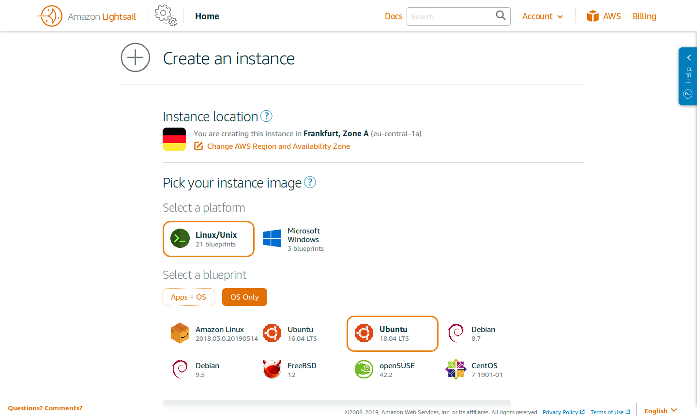
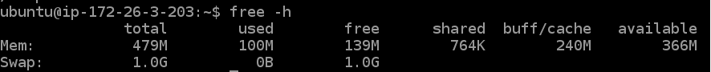
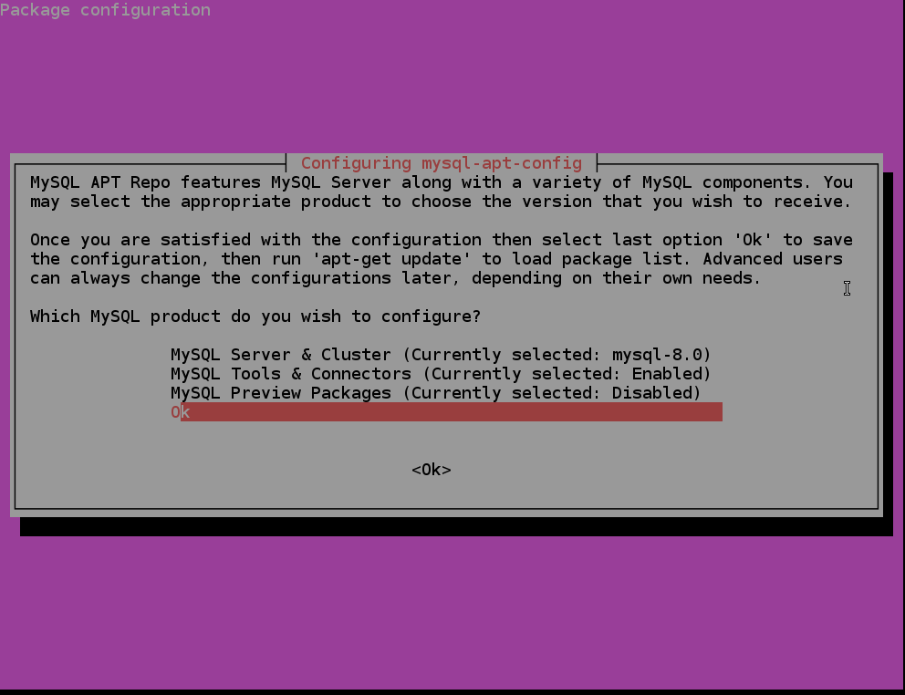
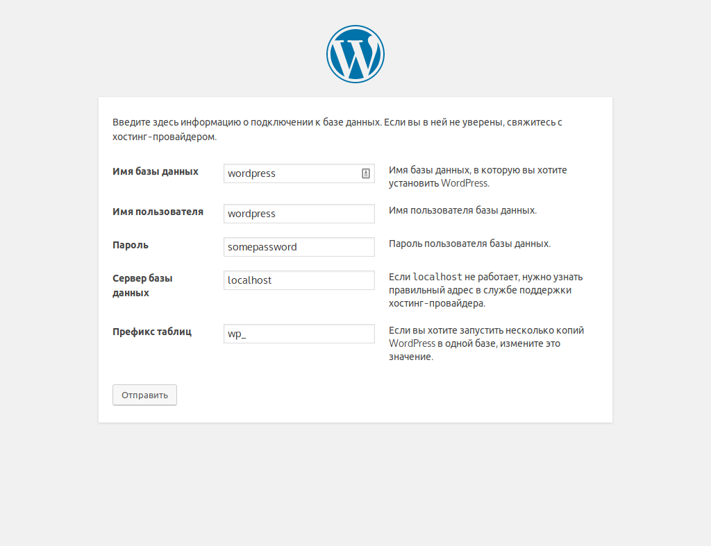
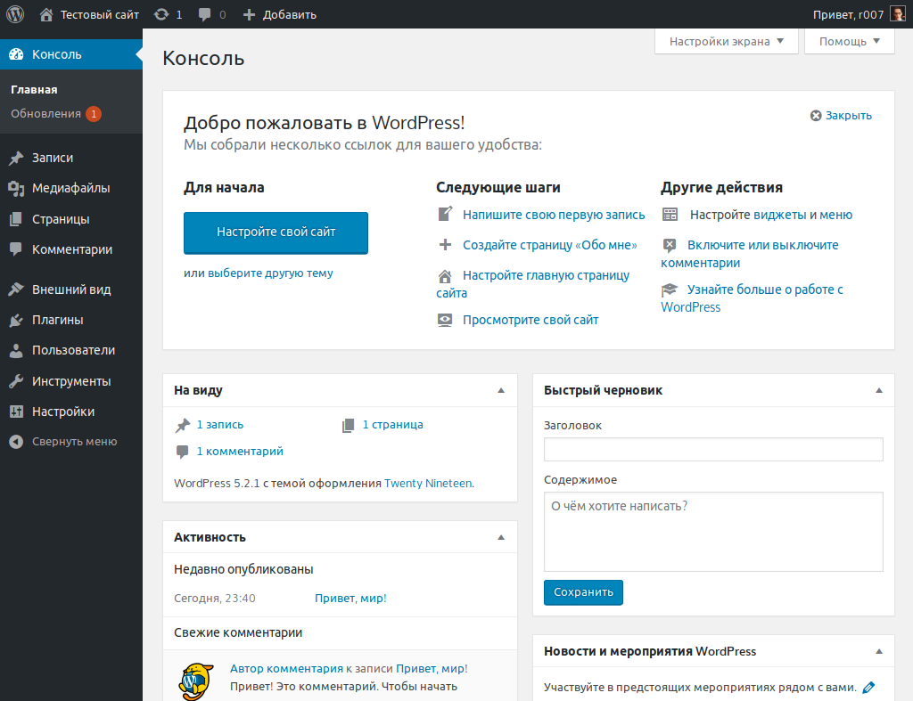
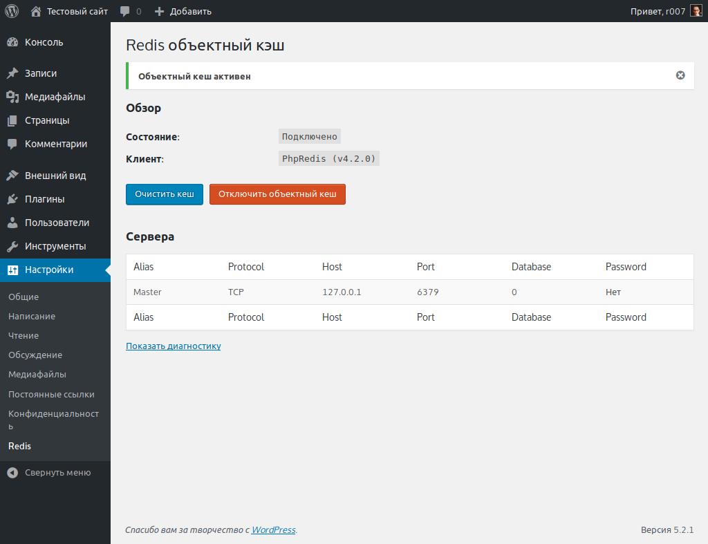
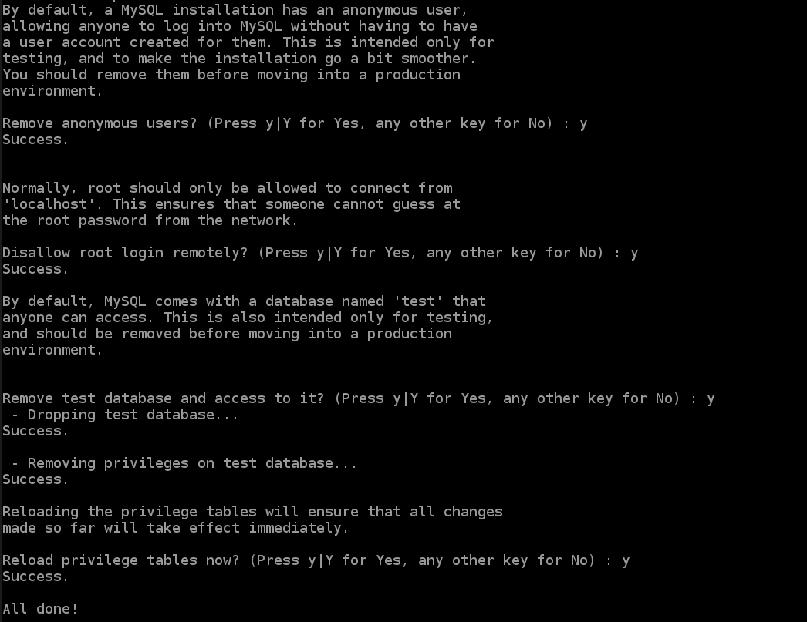

В этом уроке мы установим на Ubuntu веб-сервер **Nginx**, базу данных **MySQL 8**, последнюю версию **PHP 7.3** в связке с **Redis**.

---

За что я люблю VPS, так это за гибкость и возможность тонкой настройки сервера «под себя». Но с другой стороны, приходится быть одновременно и сисадмином и веб-разработчиком, следить за работоспособностью сервера. На shared-хостингах эту работу выполняют администраторы хостинга.

Почему именно **AWS Lightsail**? Во-первых, относительно невысокая стоимость. За $3.5 в месяц (около 2.700 рублей в год) вы получаете полноценный VPS с 512 Мб оперативной памяти и 20 Гб места на SSD диске. На таком VPS при желании можно размещать 2-3 небольших сайта. Похожие хостинг-планы есть и у Digital Ocean например. 

Во-вторых, потенциал расширения функциональности сайта за счет сервисов амазона (например возможность хранить данные в облаке с AWS S3 или размещать статические файлы на AWS CloudFront).

## Подготовка

Я не буду подробно останавливаться на этапе регистрации, будем считать, что у вас уже есть активная учетная запись Amazon. После этого просто перейдите в [панель управления](https://lightsail.aws.amazon.com/ls/webapp/home) и нажмите «Create instance».  



Для этого урока я буду использовать Ubuntu 18.04 LTS, так как он прост в настройке по сравнению с тем же FreeBSD. Буковки LTS в названии означают стабильную версию, то есть у вас будет не самое новое, а старое, но проверенное ПО.   

Здесь очень заманчиво использовать готовый шаблон «**WordPress 5.1.1-2**», но не спешите! Если вы такой же жадный как и я, пожадничали и взяли самый дешевый хостинг-план за $3.5, то на 512 мегабайтах оперативки вам будет ооооочень несладко. Их едва хватает, чтобы запустить MySQL/Apache/PHP. А со временем начнет отваливаться база данных из-за нехватки памяти.

Поэтому первым шагом стоит:
* Обновить систему
* Увеличить файл подкачки
* Установить и оптимизировать MySQL под скромное «железо»

По-хорошему, если деньги позволяют и вы выбрали хостинг-план получше, с 1-2-4 гигабайтами ОЗУ, этого вполне должно хватить и подкачку можно не добавлять. Но мы легких путей не ищем, будем все на 512 Мб делать. 

### Обновление системы

Итак, вы создали образ ОС Ubuntu, поздравляю! Нажимаем «**Connect using SSH**», откроется окно, куда мы и будем вводить команды. Первым делом обновляемся:

```shell
sudo apt-get update
sudo apt-get upgrade
```

Ждем несколько минут, пьем кофе пока все пакеты скачаются и установятся. Вот собственно и всё.

### Увеличиваем файл подкачки

Вначале стоит проверить, а использует ли система подкачку в данный момент или нет?

```shell
sudo swapon --show
```

Если команда ничего не вывела, значит в данный момент подкачка не настроена. Проверяем это командой ```free```:

```shell
free -h
```


Общее правило для подкачки — если у вас < 2 Гб оперативной памяти, размер файла подкачки должен быть **текущий размер ОЗУ × 2**, в нашем случае 1 Гб. Создаем нужный файл,

```shell
sudo fallocate -l 1G /swapfile
```

Проверяем, что файл действительно создался,

```shell
ls -lh /swapfile
```

Показывает `-rw-r--r-- 1 root root 1.0G May 31 20:08 /swapfile`, значит что место под файл успешно выделено. Теперь нужно поменять права на файл, чтобы его мог открыть только суперпользователь,

```shell
sudo chmod 600 /swapfile
```

И пометить файл как файл подкачки, дать возможность системе использовать его.

```shell
sudo mkswap /swapfile
sudo swapon /swapfile
```

Теперь команда `free -h` должна показать наличие подкачки размером 1 Гб.



Готово! Осталась лишь пара нюансов. Вносим изменения в fstab.

```shell
sudo cp /etc/fstab /etc/fstab.bak
echo '/swapfile none swap sw 0 0' | sudo tee -a /etc/fstab
```

И последнее изменение — по умолчанию, система начинает использовать swap при 60%-ой загрузке памяти. Для настольных компьютеров это неплохо, но у сервера это значение должно быть близким к нулю. Так как мы не хотим лишний раз нагружать диск.

```shell
sudo nano /etc/sysctl.conf
```

В самый конец файла добавляем:
```shell
vm.swappiness=10
```

Перезагружаем систему, убеждаемся что всё работает исправно, радуемся.

## Установка и настройка MySQL 8

Версия MySQL 8 считается наиболее производительной на данный момент, но её нет в репозитории 18.04 по умолчанию. Скачиваем и настраиваем конфиги MySQL:

```shell
wget -c https://dev.mysql.com/get/mysql-apt-config_0.8.13-1_all.deb
sudo dpkg -i mysql-apt-config_0.8.13-1_all.deb
``` 

В окне настройки нужно просто выбрать "Ok", всё остально оставляем по умолчанию.



Устанавливаем сервер MySQL.

```shell
sudo apt update
sudo apt-get install mysql-server -y
```

Появится окно выбора метода аутентификации, где лучше выбрать "Use Legacy Authentication Method". Насколько я знаю, WordPress пока ещё не умеет аутентифицироваться по SHA256.


После установки, MySQL сразу же запустится. Но вначале нам ещё потребуется немного подредактировать конфигурацию и ограничить максимальный размер буфера БД. Открываем файл:

```shell
sudo nano /etc/mysql/my.cnf
```

Добавляем следующие строки в конец конфига:

```apacheconfig
[mysqld]

# other variables here
innodb_buffer_pool_size = 128M # (обычно 50%-70% от общего количества памяти)
innodb_log_file_size = 256M
innodb_flush_log_at_trx_commit = 1 # можно изменить на 2 или 0
innodb_flush_method = O_DIRECT
```
Нажимаем Ctrl+O, сохраняем файл и перезапускаем MySQL командой

```shell
sudo service mysql restart
```

## Устанавка PHP 7.3

Здесь всё довольно просто и понятно. Выполняем несколько команд, ждем и готово.

```shell
sudo add-apt-repository ppa:ondrej/php
sudo apt-get -y install php7.3
apt-get purge apache2 -y
apt-get install -y tmux curl wget php7.3-fpm php7.3-cli php7.3-curl php7.3-gd php7.3-intl 
apt-get install -y php7.3-mysql php7.3-mbstring php7.3-zip php7.3-xml unzip php7.3-soap php7.3-redis 
```

## Установка и настройка веб-сервера Nginx

Устанавливаем nginx:

```shell
sudo apt-get install nginx -y
```

Далее я буду использовать готовые конфиги, чтобы сэкономить время. В них уже есть настройки для кэширования статических файлов, SSL и т.д.

```shell
git clone https://github.com/dhilditch/wpintense-rocket-stack-ubuntu18-wordpress
sudo cp wpintense-rocket-stack-ubuntu18-wordpress/nginx/* /etc/nginx/ -R
sudo ln -s /etc/nginx/sites-available/rocketstack.conf /etc/nginx/sites-enabled/
sudo rm /etc/nginx/sites-enabled/default
```  

После того как мы скачали и скопировали все настройки, самое время создать директорию для кеша.

```shell
sudo mkdir /var/www/cache
sudo mkdir /var/www/cache/rocketstack
sudo chown www-data:www-data /var/www/cache/ -R
```

Осталось только отредактировать имя сервера, открываем конфиг,

```shell
sudo nano /etc/nginx/sites-available/rocketstack.conf
```

И меняем

```apacheconfig
server_name www.yourdomain.com;
```

На ваше имя домена. Нажимаете Ctrl+O, сохраняете файл. После этого нужно перезапустить nginx, чтобы настройки вступили в силу.

```shell
sudo service nginx restart
```

Если вы всё сделали правильно, то открыв сайт по IP-адресу, вы увидите ошибку 404. Это нормально, просто мы пока ещё не загрузили WordPress. 


## Установка WordPress

Наконец-таки мы дошли до самой главной части. Но прежде, нужно создать базу данных для WordPress и отдельного пользователя. Заходим в консоль MySQL:

```shell
mysql -u root -p
```

Вас спросят пароль, который вы ввели при установке. Далее, создаем базу данных.

```sql
CREATE DATABASE wordpress;
CREATE USER 'wordpress'@'localhost' IDENTIFIED WITH mysql_native_password BY 'SOMEPASSWORD';
GRANT ALL PRIVILEGES ON wordpress.* TO'wordpress'@'localhost';
EXIT;
```

Скачиваем сам WordPress, распаковываем и копируем.

```shell
sudo wget https://wordpress.org/latest.zip -P /var/www/
sudo unzip /var/www/latest.zip -d /var/www/
sudo mv /var/www/wordpress /var/www/rocketstack
sudo chown -R www-data:www-data /var/www/rocketstack
sudo rm /var/www/latest.zip
```

После этого можно открывать сайт, начнется установка WordPress'а, где вам потребуется ввести все необходимые данные которые вы указали ранее (название базы данных, пользователь, пароль и т.д.).



Всё, на этом установка завершена! Осталось лишь настроить пару деталей.



## Послеустановочная настройка

### Устанавливаем Redis

```shell
sudo apt-get install -y redis 
```

Я просто оставлю все настроки по умолчанию. После этого вам потребуется установить плагин под названием "[Redis Object Cache](https://wordpress.org/plugins/redis-cache/)" и в настройках включить объектный кеш. Всё.

   

### Меняем настройки PHP

По умолчанию, в настройках PHP есть парочка неприятных моментов. Во-первых, это ограничение на размер загружаемых файлов в 2 Мб (не получится загрузить большой архив с темой). И второе — это ограничение на время выполнения скрипта в 30 секунд (не получится импортировать демо-данные темы). Увеличить эти параметры можно таким образом:

```shell
sudo nano /etc/php/7.3/fpm/php.ini
```

Находим параметры и меняем их значения.

```apacheconfig
max_execution_time = 1000
upload_max_filesize = 50M
```

Сохраняем и перезапускаем PHP-FPM.

```shell
sudo service php7.3-fpm restart
```

### Защищаем MySQL

MySQL по умолчанию недоступен с любого хоста, кроме localhost. Так что он с самого начала довольно неплохо защищен, но с помощью команды

```shell
mysql_secure_installation
```

Его можно обезопасить ещё лучше. Лично я на все вопросы ответил `yes`, кроме самого первого. Компонент Validate Password нам не нужен в данном случае. 



## Заключение

Поздравляю! Надеюсь у вас получилось установить WordPress. За кадром осталась регистрация доменного имени, получение SSL-сертификата с помощью Letsencrypt, а также настройка CDN. Не стал добавлять эту часть, так как урок и так получился слишком объемным. Но в других статьях я попробую подробнее остановиться на этой теме.

Всем хорошего настроения 
🙂 
