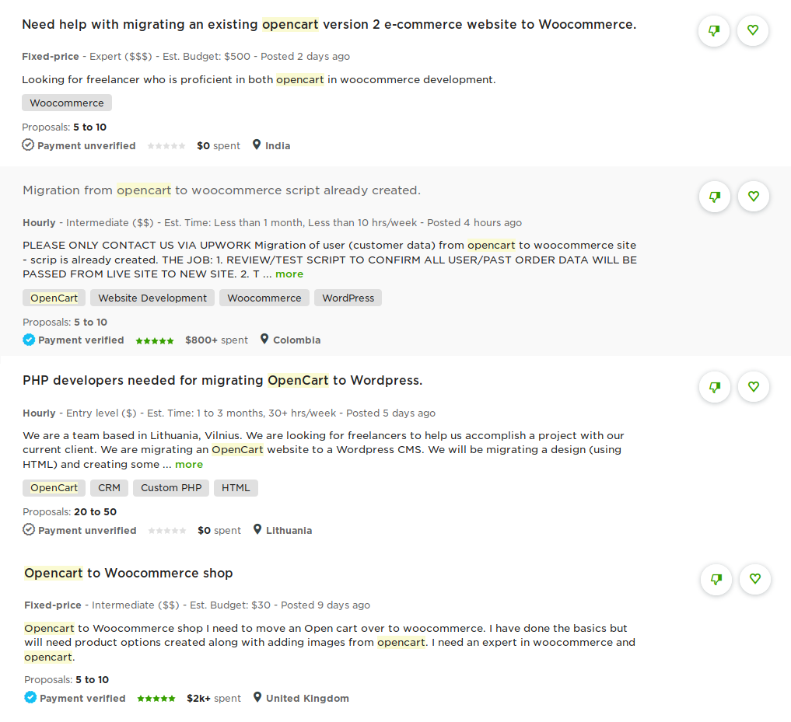
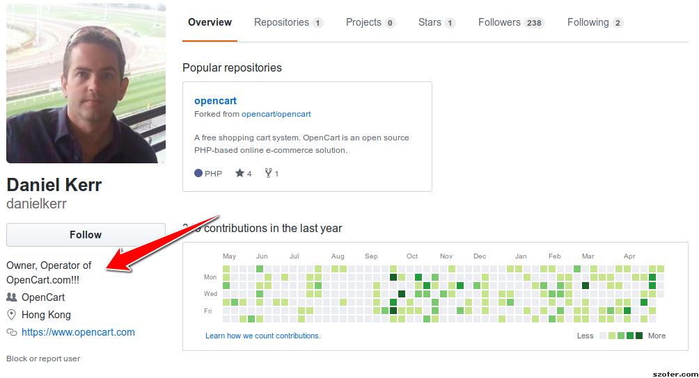
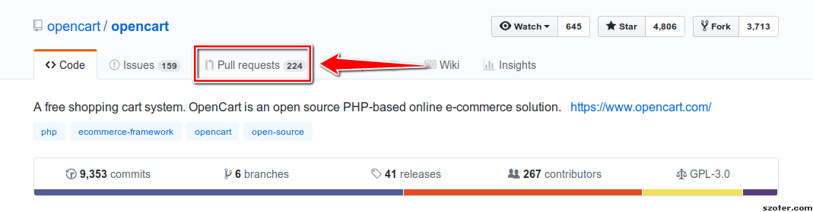

Система OpenCart пользуется необъяснимой популярностью в русскоязычной среде. В этой статье я хотел бы подробно рассказать обо всех недостатках с точки зрения веб-разработчика.

Основной аргумент в пользу OpenCart — эта система якобы по-особому оптимизирована для интернет-магазинов (по сравнению с WooCommerce). Но вот почему-то счастливые владельцы магазинов OpenCart массово мигрируют на плохой, неоптимизированный WordPress:



Но может быть они ошибаются? Давайте рассмотрим эту систему поближе.

## База данных

Самое первое, что бросается в глаза — OpenCart работает на допотопном MyISAM движке. На сегодняшний день он считается устаревшим. Одной из задач базы данных является координация одновременного доступа к БД. MySQL решает эту задачу с помощью механизма блокировок. Если два клиента пытаются одновременно внести изменения, MySQL во избежании конфликта блокирует одного из клиентов до завершения операции.  

Основной недостаток MyISAM в том, при обновлении или добавлении данных происходит блокировка **всей базы данных**. Этот недостаток решили в InnoDB, заменив на построчную блокировку и добавив дополнительную защиту от сбоев.

### Как это может проявится?
Небольшой интернет-магазин скорее всего не заметит разницы между MyISAM и InnoDB, не так уж часто два покупателя одновременно добавляют товар в корзину. Разница будет видна при большом траффике и пиковой нагрузке («Черная пятница» например).

Более того, данные продукта в OpenCart разбросаны по 8-9 таблицам. Безумнейший запрос, который получает сведения о продукте:

```sql
SELECT cp.`id_product_attribute`, cp.`id_product`, cp.`quantity` AS cart_quantity, pl.`name`,
		pl.`description_short`, pl.`available_now`, pl.`available_later`, p.`id_product`, p.`id_category_default`, p.`id_supplier`, p.`id_manufacturer`, p.`id_tax`, p.`on_sale`, p.`ecotax`,
		p.`quantity`, p.`price`, p.`reduction_price`, p.`reduction_percent`, p.`reduction_from`, p.`reduction_to`, p.`weight`, p.`out_of_stock`, p.`active`, p.`date_add`, p.`date_upd`,
		t.`id_tax`, tl.`name` AS tax, t.`rate`, pa.`price` AS price_attribute, pa.`quantity` AS quantity_attribute, 
        pa.`ecotax` AS ecotax_attr, i.`id_image`, il.`legend`, pl.`link_rewrite`, cl.`link_rewrite` AS category, CONCAT(cp.`id_product`, cp.`id_product_attribute`) AS unique_id,
        IF (IFNULL(pa.`reference`, \'\') = \'\', p.`reference`, pa.`reference`) AS reference, 
        IF (IFNULL(pa.`supplier_reference`, \'\') = \'\', p.`supplier_reference`, pa.`supplier_reference`) AS supplier_reference, 
        (p.`weight`+ pa.`weight`) weight_attribute,
        IF (IFNULL(pa.`ean13`, \'\') = \'\', p.`ean13`, pa.`ean13`) AS ean13
		FROM `'._DB_PREFIX_.'cart_product` cp
		LEFT JOIN `'._DB_PREFIX_.'product` p ON p.`id_product` = cp.`id_product`
		LEFT JOIN `'._DB_PREFIX_.'product_lang` pl ON (p.`id_product` = pl.`id_product` AND pl.`id_lang` = '.intval($this->id_lang).')
		LEFT JOIN `'._DB_PREFIX_.'product_attribute` pa ON (pa.`id_product_attribute` = cp.`id_product_attribute`)
		LEFT JOIN `'._DB_PREFIX_.'tax` t ON (t.`id_tax` = p.`id_tax`)
		LEFT JOIN `'._DB_PREFIX_.'tax_lang` tl ON (t.`id_tax` = tl.`id_tax` AND tl.`id_lang` = '.intval($this->id_lang).')
		LEFT JOIN `'._DB_PREFIX_.'product_attribute_image` pai ON (pai.`id_product_attribute` = cp.`id_product_attribute`)
		LEFT JOIN `'._DB_PREFIX_.'image` i ON (i.`id_product` = cp.`id_product` AND (IF(pai.`id_image`, pai.`id_image` = i.`id_image`, i.`cover` = 1)))
		LEFT JOIN `'._DB_PREFIX_.'image_lang` il ON (i.`id_image` = il.`id_image` AND il.`id_lang` = '.intval($this->id_lang).')
		LEFT JOIN `'._DB_PREFIX_.'category_lang` cl ON (p.`id_category_default` = cl.`id_category` AND cl.`id_lang` = '.intval($this->id_lang).')
		WHERE `id_cart` = '.intval($this->id).'
		'.($id_product ? ' AND cp.`id_product` = '.intval($id_product) : '').'
		AND p.`id_product` IS NOT NULL
		GROUP BY unique_id
		ORDER BY cp.date_add ASC';
```

Он выполняется в нескольких местах внутри циклов, без какого-либо кеширования, что негативно сказывается на производительности. Во всей системе нет и намека на кеширование. Самое смешное, что он присутствует там, где совсем не нужен — в админке. Но не на фронтэнде.  

## Качество кода

Очень низкое. По-видимому, Ctrl+C, Ctrl+V любимая комбинация клавиш Дэниэла Керра (создателя OpenCart). Код содержит множество повторений там, где следовало использовать циклы `foreach` и выносить код в функции. Хороший стиль программирования — когда проектируют общие решения, а не копируют куски кода, адаптируя под специфическую ситуацию. Пример ([catalog/product.php](https://github.com/opencart/opencart/blob/fc7c882cd5ba872e4ef21e71773a38f7b8f1ea33/upload/admin/controller/catalog/product.php)): 

```php
if (isset($this->request->get['filter_price'])) {
    $url .= '&filter_price=' . $this->request->get['filter_price'];
}

if (isset($this->request->get['filter_quantity'])) {
    $url .= '&filter_quantity=' . $this->request->get['filter_quantity'];
}

if (isset($this->request->get['filter_status'])) {
    $url .= '&filter_status=' . $this->request->get['filter_status'];
}
    
if (isset($this->request->get['sort'])) {
	$url .= '&sort=' . $this->request->get['sort'];
}
	
if (isset($this->request->get['order'])) {
    $url .= '&order=' . $this->request->get['order'];
}
```

Керр, зачем это велосипедостроение? Не нужно ничего изобретать, PHP обладает богатыми возможностями локализации из коробки. Это и перевод строк с помощью gettext (не нужно строки хранить в PHP-файлах, в массивах), это и класс Locale, и NumberFormatter для форматирования чисел. Только бери и используй. 

```php
public function index() {
    $this->load->language('localisation/country');
	$this->document->setTitle($this->language->get('heading_title'));
	$this->load->model('localisation/country');
	$this->getList();
}
```

Я даже не говорю о URL'ах вида `/index.php?route=product/category&path=25_29`. 

## Отношение к другим разработчикам

В своей маленькой вселенной, Керр царь и бог. Как он сам о себе пишет:



Являясь по сути единоличным владельцем и главным разработчиком, он игнорирует других программистов. На 224 pull request'а положен жирнющий болт, а ведь это могли бы быть исправления, улучшения, которые не получат конечные пользователи.
  


## Вывод

Весьма посредственный продукт. Обновляется редко, сделан на коленке с кучей детских болезней. В плане функциональности — всё тоже самое есть и в WooCommerce, и в PrestaShop. Если хотите несложную, качественную систему, возьмите лучше PrestaShop.  
