В предыдущей статье "[Шустрый WordPress на AWS Lightsail с кешированием Redis](/lightsail-wordpress)" я рассказывал как настроить веб-сервер Nginx на максимальную производительность в связке с MySQL и Redis, но сегодня решил её обновить и заменить на ещё более быстрый сервер **OpenLiteSpeed**.

О нём так же до этого писал -- "[5 причин использовать OpenLiteSpeed вместо Nginx](/openlitespeed)". Это бесплатный открытый веб-сервер, легковесный и с дружественным веб-интерфейсом. Вы сами сможете легко создавать веб-сайты и управлять ими.

Когда речь заходит о веб-серверах, таких как Apache2, Nginx и других, то OpenLiteSpeed можно ставить на пьедестал почета, учитывая его соотношение скорости, безопасности, масштабируемости и дружелюбности к пользователю.

---

Итак, в этом уроке мы установим на Ubuntu веб-сервер **OpenLiteSpeed**, базу данных **MySQL 8** и **PHP 7.3**.

## Подготовка

В качестве хостинга я выбрал [AWS Lightsail](https://aws.amazon.com/ru/lightsail/). Почему именно он? 

Во-первых, относительно невысокая стоимость. За $3.5 в месяц (около 2.700 рублей в год) вы получаете полноценный VPS с 512 Мб оперативной памяти и 20 Гб места на SSD диске. На таком VPS при желании можно размещать 2-3 небольших сайта. Похожие хостинг-планы есть и у Digital Ocean например. 

Во-вторых, есть потенциал расширения функциональности сайта за счет сервисов амазона (например возможность хранить данные в облаке с AWS S3 или размещать статические файлы на AWS CloudFront).

Я не буду подробно останавливаться на этапе регистрации, будем считать, что у вас уже есть активная учетная запись Amazon. После этого просто перейдите в [панель управления](https://lightsail.aws.amazon.com/ls/webapp/home) и нажмите «Create instance».  


Для этого урока я буду использовать Ubuntu 18.04 LTS, так как он прост в настройке по сравнению с тем же FreeBSD. Буковки LTS в названии означают стабильную версию, то есть у вас будет не самое новое, а старое, но проверенное ПО.   

Здесь очень заманчиво использовать готовый шаблон «**WordPress 5.2.2-3**», но не спешите! Если вы такой же жадный как и я, пожадничали и взяли самый дешевый хостинг-план за $3.5, то на 512 мегабайтах оперативки вам будет ооооочень несладко. Их едва хватает, чтобы запустить MySQL/Apache/PHP. А со временем начнет отваливаться база данных из-за нехватки памяти.

Поэтому первым шагом стоит:
* Обновить систему
* Увеличить файл подкачки
* Установить и оптимизировать MySQL под скромное «железо»

По-хорошему, если деньги позволяют и вы выбрали хостинг-план получше, с 1-2-4 гигабайтами ОЗУ, этого вполне должно хватить и подкачку можно не добавлять. Но мы легких путей не ищем, будем все на 512 Мб делать. 

### Обновление системы

Итак, вы создали образ ОС Ubuntu, поздравляю! Нажимаем «**Connect using SSH**», откроется окно, куда мы и будем вводить команды. Первым делом обновляемся:

```shell
sudo apt-get update
sudo apt-get upgrade
```

Ждем несколько минут, пьем кофе пока все пакеты скачаются и установятся. Вот собственно и всё.

### Увеличиваем файл подкачки

Вначале стоит проверить, а использует ли система подкачку в данный момент или нет?

```shell
sudo swapon --show
```

Если команда ничего не вывела, значит в данный момент подкачка не настроена. Проверяем это командой ```free```:

```shell
free -h
```

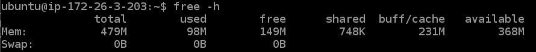

Общее правило для подкачки — если у вас < 2 Гб оперативной памяти, размер файла подкачки должен быть **текущий размер ОЗУ × 2**, в нашем случае 1 Гб. Создаем нужный файл,

```shell
sudo fallocate -l 1G /swapfile
```

Проверяем, что файл действительно создался,

```shell
ls -lh /swapfile
```

Показывает `-rw-r--r-- 1 root root 1.0G May 31 20:08 /swapfile`, значит что место под файл успешно выделено. Теперь нужно поменять права на файл, чтобы его мог открыть только суперпользователь,

```shell
sudo chmod 600 /swapfile
```

И пометить файл как файл подкачки, дать возможность системе использовать его.

```shell
sudo mkswap /swapfile
sudo swapon /swapfile
```

Теперь команда `free -h` должна показать наличие подкачки размером 1 Гб.


Готово! Осталась лишь пара нюансов. Вносим изменения в fstab.

```shell
sudo cp /etc/fstab /etc/fstab.bak
echo '/swapfile none swap sw 0 0' | sudo tee -a /etc/fstab
```

И последнее изменение — по умолчанию, система начинает использовать swap при 60%-ой загрузке памяти. Для настольных компьютеров это неплохо, но у сервера это значение должно быть близким к нулю. Так как мы не хотим лишний раз нагружать диск.

```shell
sudo nano /etc/sysctl.conf
```

В самый конец файла добавляем:
```shell
vm.swappiness=10
```

Перезагружаем систему, убеждаемся что всё работает исправно, радуемся.

## Установка и настройка MySQL 8

Версия MySQL 8 считается наиболее производительной на данный момент, но её нет в репозитории 18.04 по умолчанию. Скачиваем и настраиваем конфиги MySQL:

```shell
wget -c https://dev.mysql.com/get/mysql-apt-config_0.8.14-1_all.deb
sudo dpkg -i mysql-apt-config_0.8.14-1_all.deb
``` 

В окне настройки нужно просто выбрать "Ok", всё остально оставляем по умолчанию.

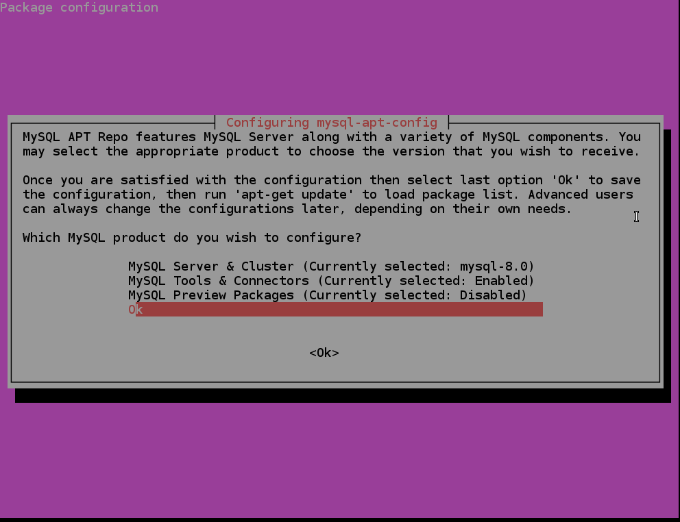

Устанавливаем сервер MySQL.

```shell
sudo apt update
sudo apt-get install mysql-server -y
```

Появится окно выбора метода аутентификации, где лучше выбрать "Use Legacy Authentication Method". Насколько я знаю, WordPress пока ещё не умеет аутентифицироваться по SHA256.

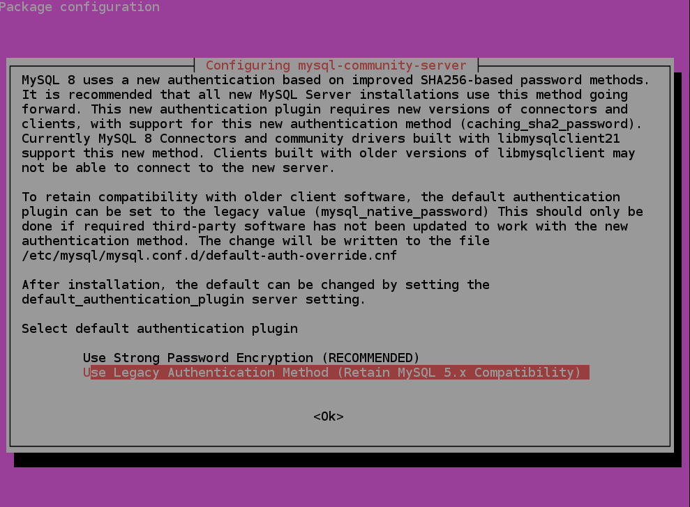

После установки, MySQL сразу же запустится. Но вначале нам ещё потребуется немного подредактировать конфигурацию и ограничить максимальный размер буфера БД. Открываем файл:

```shell
sudo nano /etc/mysql/my.cnf
```

Добавляем следующие строки в конец конфига:

```ini
[mysqld]

# other variables here
innodb_buffer_pool_size = 128M # (обычно 50%-70% от общего количества памяти)
innodb_log_file_size = 256M
innodb_flush_log_at_trx_commit = 1 # можно изменить на 2 или 0
innodb_flush_method = O_DIRECT
```
Нажимаем Ctrl+O, сохраняем файл и перезапускаем MySQL командой

```shell
sudo service mysql restart
```

## Установка и настройка OpenLiteSpeed

Перед установкой веб-сервера нужно добавить официальный репозиторий Litespeed Tech:

```shell
wget -O - http://rpms.litespeedtech.com/debian/enable_lst_debian_repo.sh | sudo bash
``` 

Теперь можно установить OpenLiteSpeed с помощью apt.

```shell
sudo apt-get install openlitespeed
```

Данная команда скачает и установит стабильную версию **1.5.10** (последняя на момент написания статьи была 1.6.4). Это связано с тем, что в LTS-версии дистрибутива используются немного староватые, но проверенные версии. Если вы любите использовать самое новое ПО, имеет смысл обновить Ubuntu до 19.10, либо собрать веб-сервер вручную из исходного кода.

Теперь защищаем доступ к веб-серверу и устанавливаем пароль администратора.

```shell
sudo /usr/local/lsws/admin/misc/admpass.sh
```

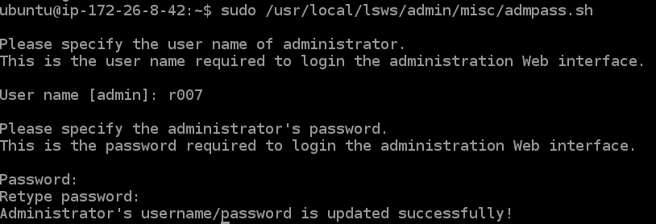

После этого можно запускать веб-сервер.

```shell
sudo systemctl start lsws
```

Проверить состояние веб-сервера можно командой

```shell
sudo systemctl status lsws
```

Сервер запущен, но радоваться ещё рано. По умолчанию, AWS блокирует все порты кроме протокола HTTP (80) и SSH (22), нужно открыть вкладку "Networking" и вручную добавить правила для файрволла.

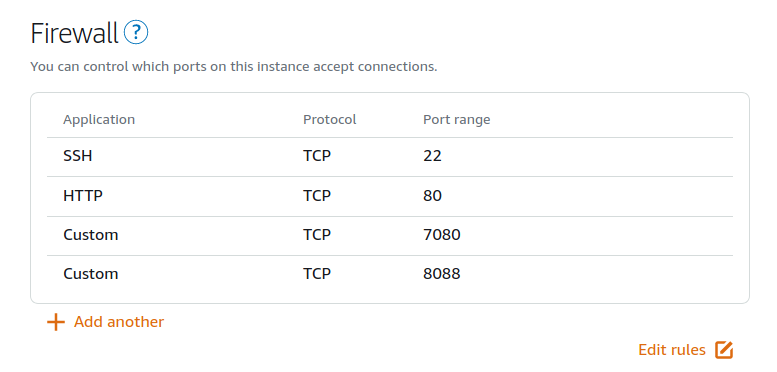

Откройте в браузере IP вашего сервера, с последующим **8088** на конце:

http://ip_адрес_сервера:8088/


Для доступа к панели администратора, используйте порт **7080**:

http://ip_адрес_сервера:7080/

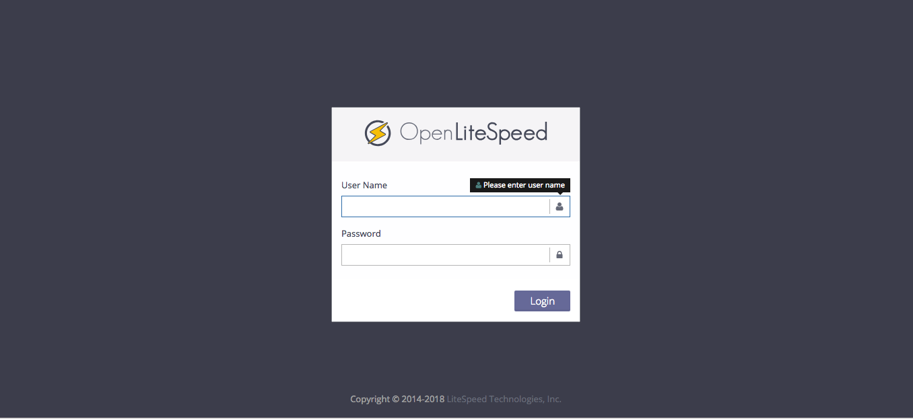

## Установка PHP 7.3 и модулей

С помощью apt установим PHP и все обходимые модули:


```shell
sudo apt install lsphp73 lsphp73-curl lsphp73-imap lsphp73-mysql lsphp73-intl lsphp73-pgsql lsphp73-sqlite3 lsphp73-tidy lsphp73-snmp
```

После этого создадим символическую ссылку на веб-сервер.

```shell
sudo ln -sf /usr/local/lsws/lsphp73/bin/lsphp /usr/local/lsws/fcgi-bin/lsphp73
```

Всё, на этом установка PHP завершена. Осталось лишь настроить сервер через панель администрирования. Для этого зайдем по адресу https://ip_адрес_сервера:7080.

Выберите **Server Configuration ➡️ External App**, затем нажмите на иконку редактирования.

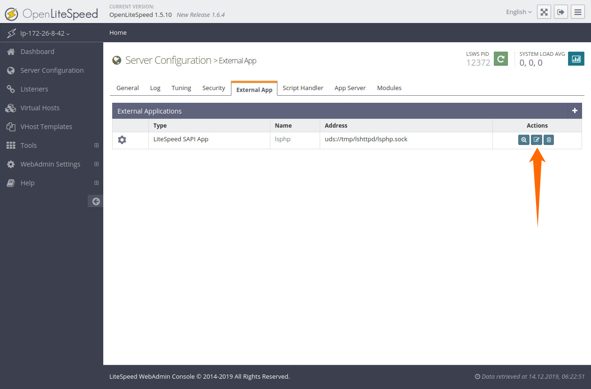

Прокрутите вниз до поля **Command**, туда нужно вставить пути к символической ссылке которую мы создали:

```shell
$SERVER_ROOT/fcgi-bin/lsphp73
```

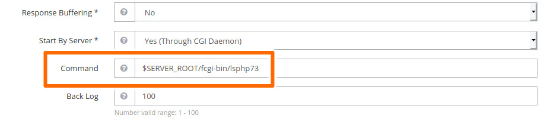

Далее, перейдите **Virtual Hosts ➡️ General page**, нажмите на иконку редактирования и впишите ```index.php``` в поле **Index File** как показано ниже.

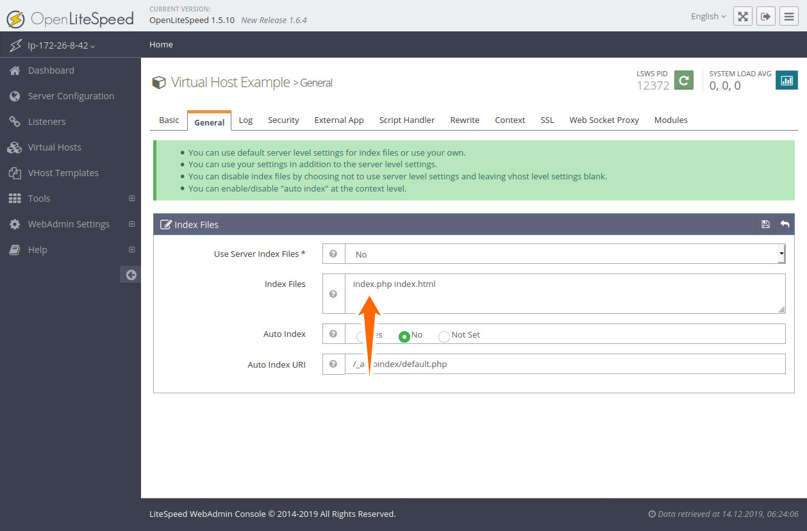

Затем, выберите вкладку **Rewrite** и включите **Rewrite Control**.

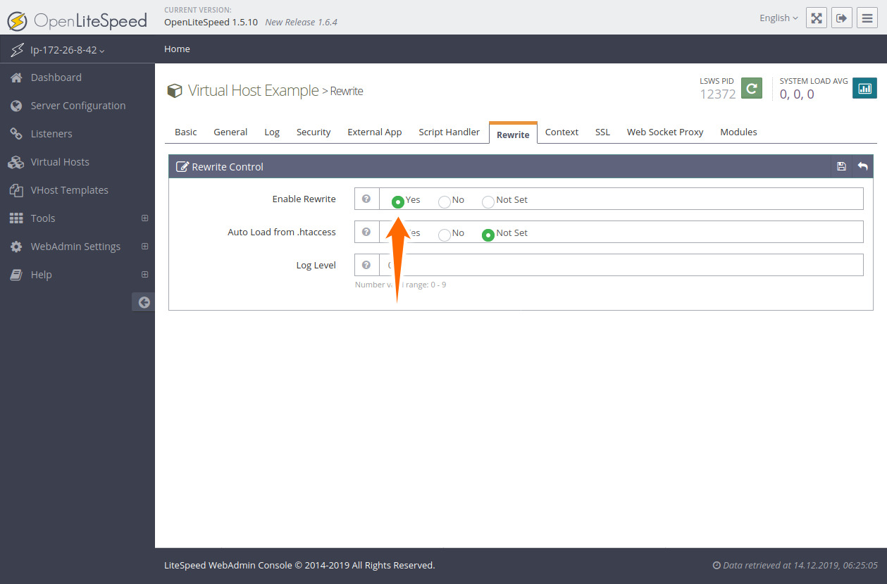 

Затем добавьте следующий код в поле Rewrite Rules:

```apacheconfig
RewriteRule ^index\.php$ - [L]
RewriteCond %{REQUEST_FILENAME} !-f
RewriteCond %{REQUEST_FILENAME} !-d
RewriteRule . /index.php [L]
```

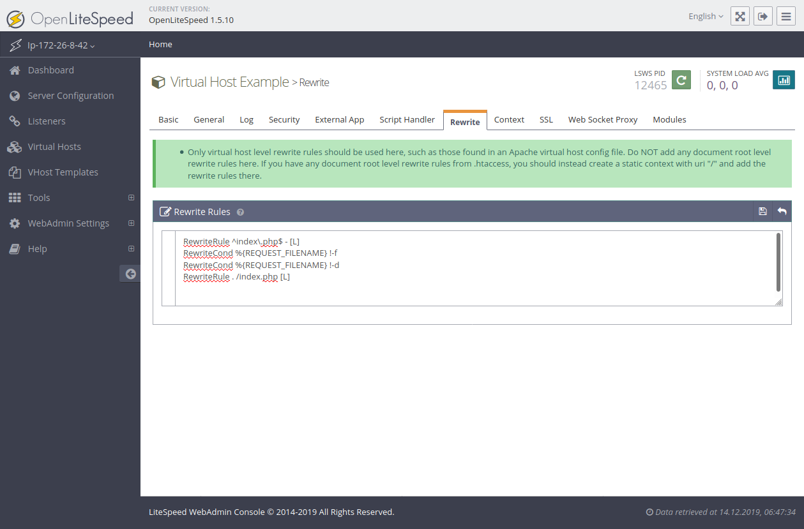

Сохранитесь. И наконец, в левом меню выберите **Listeners** и измените текущий порт с 8088 на **80**. Сохранитесь после этого.

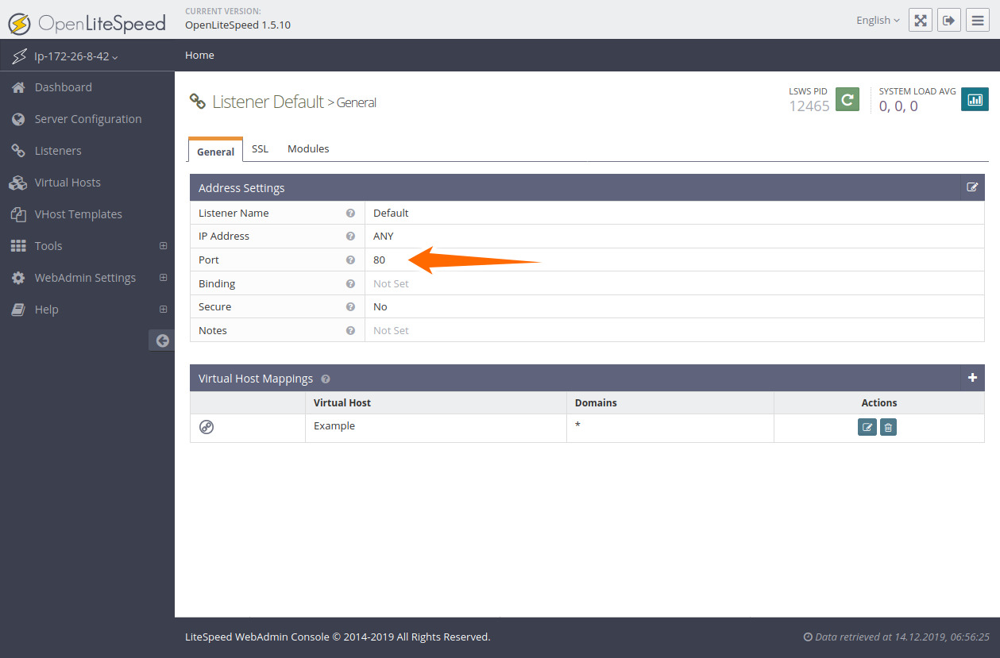

После этого можно сервер перезапустить нажатием на зеленую кнопку вверху. Если вы всё правильно сделали, то перейдя по адресу http://ip_вашего_сервера/phpinfo.php, вы увидите следующую картину:

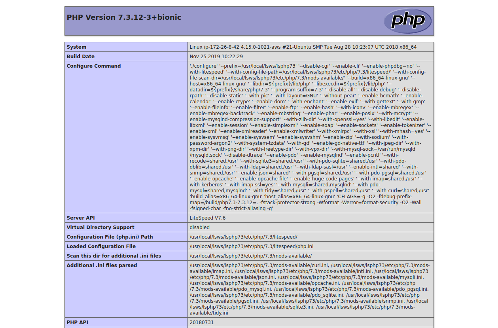

Поздравляю! Теперь осталось только установить WordPress.

## Установка WordPress

Наконец-таки мы добрались до самой главной части. Но прежде, нужно создать базу данных для WordPress и отдельного пользователя. Заходим в консоль MySQL:

```shell
mysql -u root -p
```

Вас спросят пароль, который вы ввели при установке. Далее, создаем базу данных.

```sql
CREATE DATABASE wordpress;
CREATE USER 'wordpress'@'localhost' IDENTIFIED WITH mysql_native_password BY 'SOMEPASSWORD';
GRANT ALL PRIVILEGES ON wordpress.* TO'wordpress'@'localhost';
EXIT;
```

Скачиваем сам WordPress, распаковываем и копируем.

```shell
sudo apt-get install unzip
cd /usr/local/lsws/Example/html/
sudo rm -rf ./*
sudo wget https://wordpress.org/latest.zip -P .
sudo unzip ./latest.zip -d .
sudo mv -v wordpress/* .
sudo rm -rf latest.zip wordpress/
```

Осталось ещё изменить права на папку.

```shell
sudo chown -R nobody:nogroup ../html
```

После этого можно открывать сайт, начнется установка WordPress’а, где вам потребуется ввести все необходимые данные которые вы указали ранее (название базы данных, пользователь, пароль и т.д.).


Всё, на этом установка завершена! Осталось лишь установить плагин.

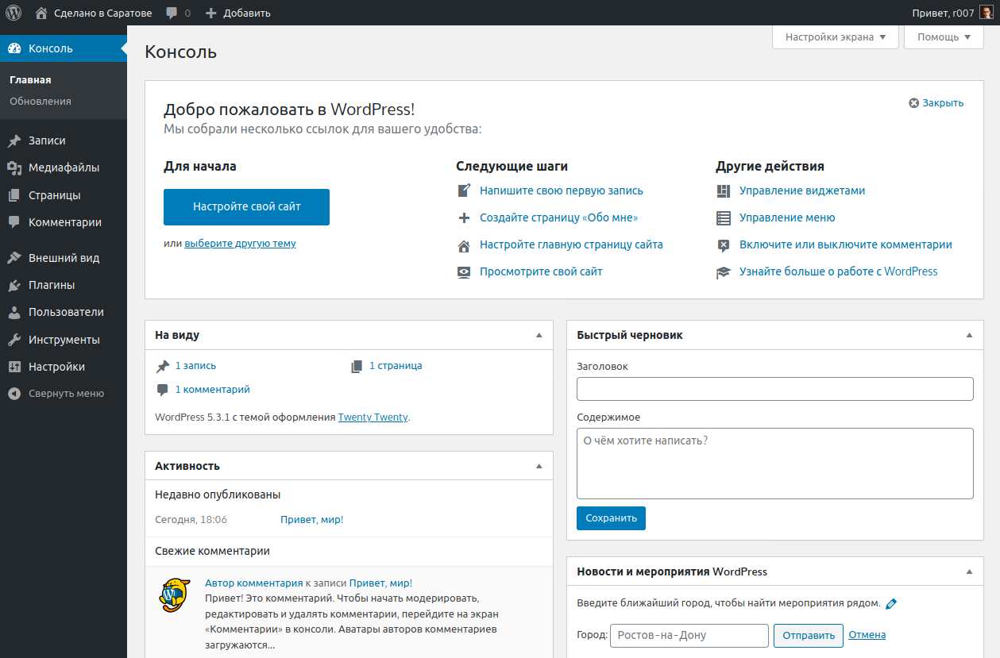

Плагин LiteSpeed Cache -- самая ценная часть веб-сервера OpenLiteSpeed. Он умеет оптимизировать изображения, минифицировать CSS, JavaScript и HTML, добавляет ленивую загрузку изображений и многое другое. Переходим в **Плагины ➡️ Добавить новый**, в строке поиск пишем "LiteSpeed Cache", жмем установить.

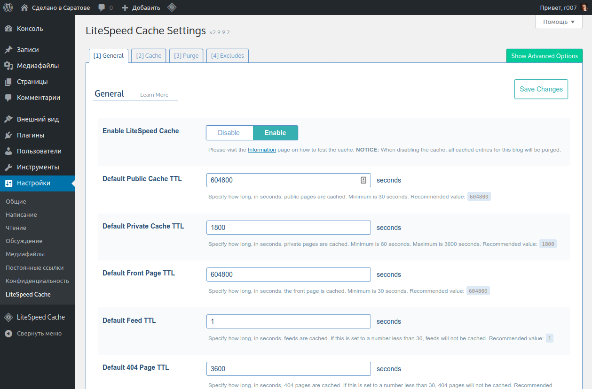

Конец. Теперь сайтом можно полноценно пользоваться 😀
