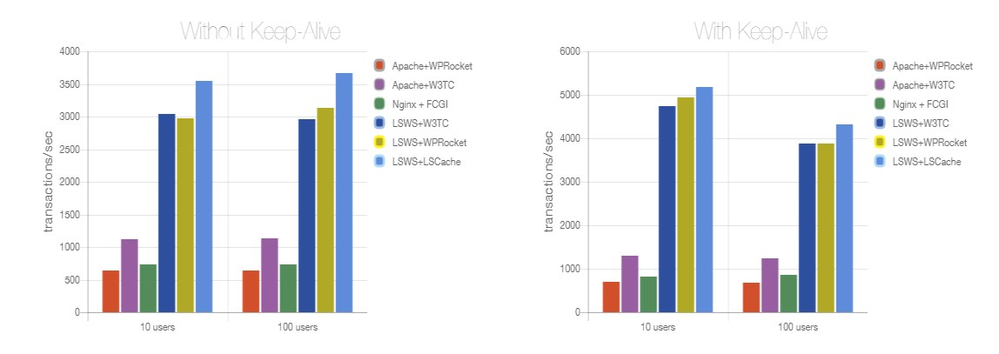
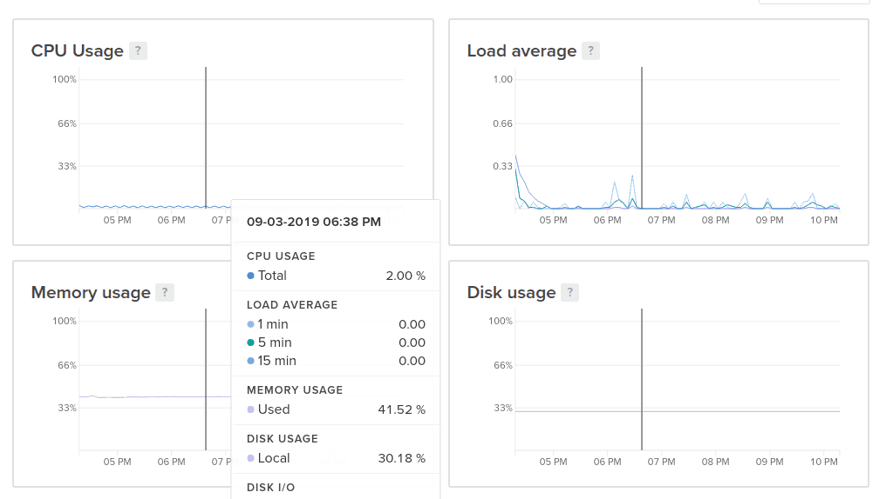
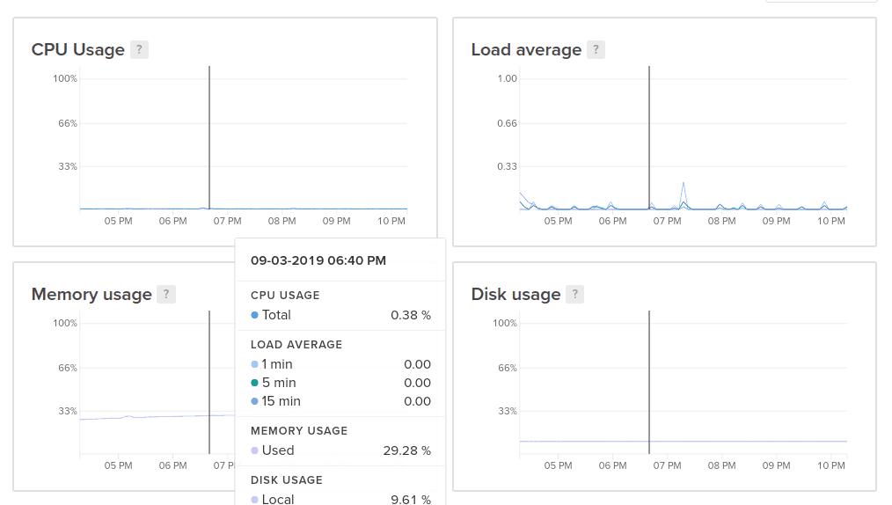
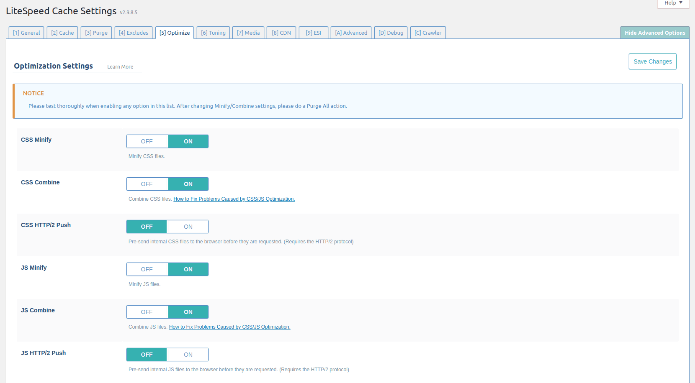
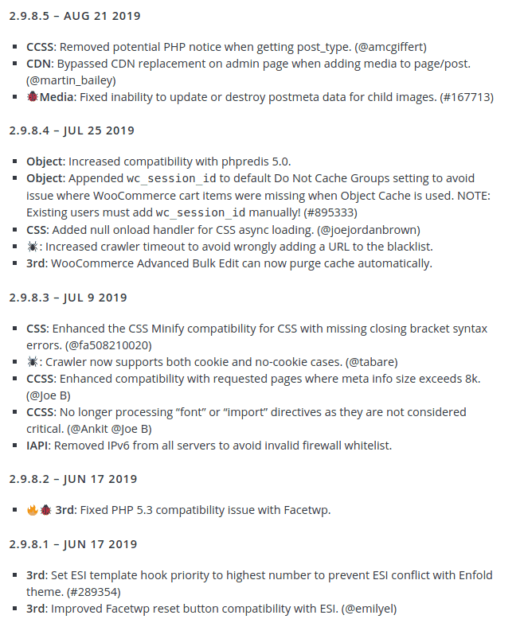
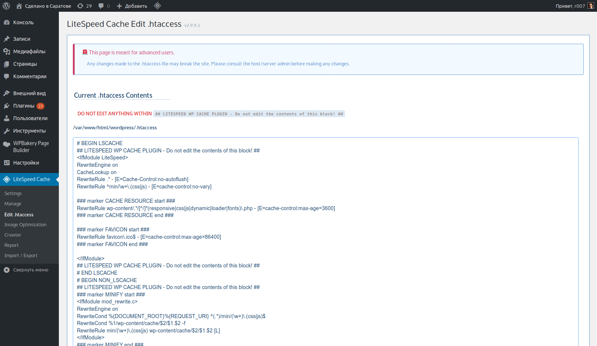

Несколько месяцев назад я начал переносить все мои сайты на OpenLiteSpeed. Также мигрировал несколько клиентов на OpenLiteSpeed и LiteSpeed Enterprise. Одной из главных причин была производительность.

Но кроме производительности есть ещё множество факторов, почему я предпочитаю OpenLiteSpeed.

Вот некоторые из них:

## 1. Высокая производительность по умолчанию

OpenLiteSpeed выигрывает в таких измерениях как TTFB (время до первого байта) и в количестве пользователей, которых сервер может обслужить одновременно. Очень удобно, если вы размещаете несколько сайтов на одном сервере.

Эксперт может максимизировать производительность Nginx через FastCGI. Есть также и готовые, оптимизированные LEMP-сборки Nginx'а, вроде [CentminMod](https://centminmod.com/). Но OpenLiteSpeed быстро работает уже по умолчанию, особенно со встренным LS Cache если сравнивать с Nginx.



## 2. Меньше затраты на хостинг

Оба веб-сервера LiteSpeed и OpenLiteSpeed имеют событийно-ориентированную архитектуру, которая использует гораздо меньше памяти (RAM) и CPU по сравнению с Nginx и Apache.

В среднем, OpenLiteSpeed потребляет на 30-40% меньше памяти, чем Nginx. Представьте, что вы тратите на Nginx VPS $80/месяц. После перехода на OpenLiteSpeed вы можете сэкономить лишние $20 и более долларов ежемесячно.

Вот как расходуют ресурсы Nginx и OpenLiteSpeed на сервере, на котором работает WooCommerce:

```grid|2


```

Подводя итог, вот результаты обоих:

|               | Использование CPU | Использование памяти |
|---------------|-------------------|----------------------|
| Nginx         | 2.0%              | 41%                  |
| OpenLiteSpeed | 0.3%              | 29%                  |

## 3. Мощный, бесплатный плагин кеширования

Что если я вам скажу, что не нужно покупать никаких кеширующих плагинов, если вы используете LiteSpeed/OpenLiteSpeed?!

LiteSpeed Technologies разработали свой собственный кэш-плагин, который прекрасно работает с их сервером. По функциональности он не уступает такими платными плагинами, как WP Rocket и Swift Performance.

Какое-то время назад я даже раздумывал купить лицензию WP Rocket. LiteSpeed Cache не такой простой как WP Rocket, но вы получите лучшие результаты если его правильно настроите. В нем есть тонкая настройка для всего.



Модуль кэша OpenLiteSpeed встроен прямо в веб-сервер и использует кеширование на основе тегов (которое сбрасывается умнее, чем в Nginx FastCGI).

В отличии от других кеш-плагинов, LiteSpeed Сache активно разрабатывается. Нет другой такой компании разрабатывающей веб-сервера, с такой тесной интеграцией с WordPress'ом!



## 4. Понимает настройки Apache .htaccess

OpenLiteSpeed легко заменит Apache. Оба веб-сервера LiteSpeed и OpenLiteSpeed понимают файлы .htaccess в ваших директориях и работают соответствующим образом.

Настройка Nginx — один из самых больших кошмаров. Ни один Nginx-конфиг не может подойти всем. Кеширующие плагины, такие плагины как WebP Express, требуют внесения правок в настройки Nginx для своей работы.

Для меня большой плюс тот факт, что не придется вручную подключаться по ssh к серверу и исправлять Nginx-конфиги (что весьма рискованно!). Всё можно сделать через админку WordPress'а, что очень удобно!  



## 5. Безопасность

Без сомнения, Nginx можно настроить на безопасность. Но LiteSpeed и OpenLiteSpeed уже имеют встроенные функции безопасности и не требуют настройки. Одна из моих любимых — предотвращение DDoS-атак с помощью reCaptcha.

Особенно эта настройка пригодилась бы ранее, когда я работал над [Business Progress](http://businessprogress.eu/). Сайт подвергся массированной DDoS-атаке, в результате нескольких дней простоя клиент понес большие потери.    

|                                             | Бесплатная версия | Enterprise |
|---------------------------------------------|-------------------|------------|
| Защита от DDoS-атак и регулирование трафика | ✅                 | ✅          |
| Защита от SSL BEAST и перехвата данных      | ✅                 | ✅          |
| Строгая проверка HTTP-запроса               | ✅                 | ✅          |
| Запрещение попыток переполнения буфера      | ✅                 | ✅          |
| PHP/Ruby/CGI/FCGI/LSAPI suEXEC              | ✅                 | ✅          |
| Совместимость с mod_security                | ✅                 | ✅          |
| Проверка SSL-клиента                        | ✅                 | ✅          |
| Защита reCaptcha                            | ✅                 | ✅          |
| Совместимость с CloudLinux CageFS           | ✅                 | ✅          |
| Защита от брутфорс-атак (WordPress)         | ❌                 | ✅          |
| Возможность chroot                          | ❌                 | ✅          |

## Но почему же хостинг-компании используют Nginx в основном?

LiteSpeed Technologies выпустили первую (платную) версию LiteSpeed в 2003-м, почти в то же время когда был выпущен Nginx. Но почему LiteSpeed не пользуется такой популярностью?

Пользователи начали проявлять интерес к LiteSpeed с выпуска open source-версии OpenLiteSpeed в 2015-м году. А сообщество WordPress заинтересовалось веб-сервером с выходом плагина LiteSpeed Cache в 2016-м году.

Многие компании уже имеют настроенные плагины кеширования, журналирования, SSL-сертификаты и т.д. Будет слишком затратно переводить все сервера на LiteSpeed. Но в будущем, надеюсь, ситуация изменится.

 
