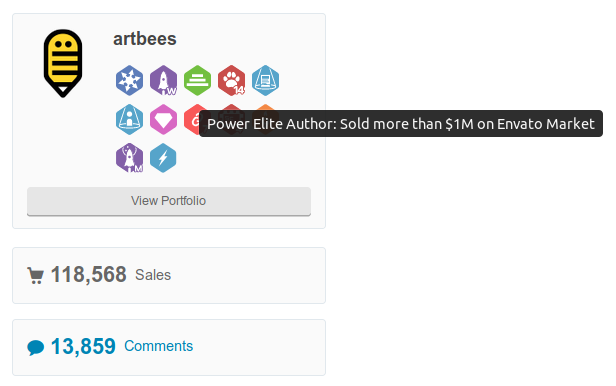
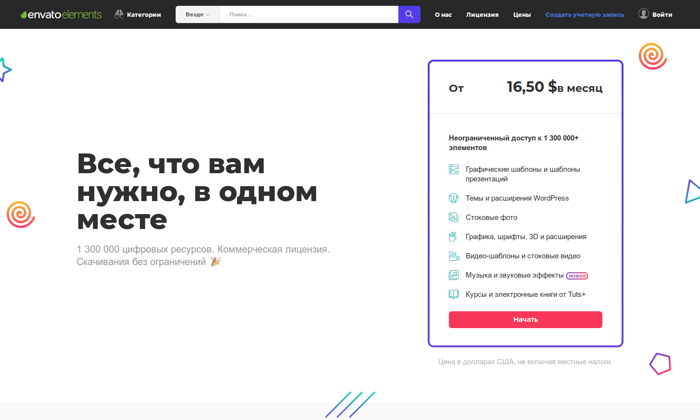

Вот такой вопрос часто задают. Люди в надежде сэкономить лишние $40-60 долларов, бесплатно скачивают темы с сомнительных сайтов. Либо как вариант: я установил пиратскую тему WordPress (или плагин), могут ли меня найти и оштрафовать? Можно ли распознать пиратскую тему?

Скажу сразу – **нет, такой возможности нету**. Если только автор темы сознательно не подложил «стукача» или если вы по глупости назвали папку с темой «avada-warezzz». Но обычно никто из-за 50 долларов за вами гоняться не будет. Так какие же ещё недостатки могут быть?

Вначале, стоит немного рассказать об особенностях работы ThemeForest из своего личного опыта. Я работал над темами [Startuply](https://themeforest.net/item/startuply-multipurpose-startup-theme/9055667) и [Ventcamp](https://themeforest.net/item/ventcamp-event-and-conference-theme/14637006), поэтому немного представляю внутреннюю кухню.

## ThemeForest и авторы тем

Правда в том, что авторы получают гроши с продаж тем. Возможно вы видели красивые цифры в стиле «продал более чем на $1 миллион долларов». Но здесь следует учитывать, что это общие продажи за несколько лет. Вычтите из этой суммы коммисию Envato (которая составляет до 30-50%), расходы на рекламу, на техподдержку, на программистов, на дизайнеров, на вспомогательное ПО (на системы клиентского обслуживания например). У тех же Artbees 19 человек в команде и они одни из топовых.

В сухом остатке получится более чем скромная сумма. Просто представьте – после того, как тема продана, её ещё нужно обслуживать 6 месяцев. **ШЕСТЬ МЕСЯЦЕВ, КАРЛ!** Примерно каждый второй или третий обращается за помощью. Вопросы самые разнообразные, начиная от «почему фоновое видео не проигрывается на мобильном телефоне» и заканчивая «почему форма обратной связи не работает».

На некоторых клиентов приходится тратить по 2, по 3 часа. Но это ещё не всё, Envato пошел ещё дальше и создал [Envato Elements](https://elements.envato.com/ru/), где можно платить $16,5/месяц и качать контент безгранично. Дешевле только бесплатно.

 

Итого, темы по сути создаются небольшой группой людей. У которых нет ни ресурсов, ни денег, ни времени чтобы хоть как-то пресекать действия пиратов. Потому что их сотни или даже тысячи, а разработчиков темы всего несколько. 

## Последствия установки пиратских тем

### 1. Отсутствие обновлений

Один из неприятных моментов, у вас не будет обновляться тема и сопуствующие плагины. Придется все находить и скачивать вручную. Если это не делать, то с выходом новой версии WordPress'а у вас может сломаться плагин или перестать работать какая-нибудь настройка (в кастомайзере например).

### 2. Отсутствие поддержки

Если возникнет проблема, опять-таки, никто вам не поможет. Хотя можно спросить в группе вконтакте например. 

### 3. Шанс подхватить вирус

Это как лотерея, повезет - не повезет. Хакеры обычно добавляют бэкдоры в темы и плагины, от которых сложно потом будет избавиться. От владельца же сайта вирус тщательно скрывается, узнать о его присутствии на вашем сайте можно от посетителей сайта. Или от гугла, когда он забанит ваш сайт. Таким образом, пожалев $50 вы рискуете заплатить столько же за удаление вируса с сайта.

## Итого

Хоть пиратство и не наказывается напрямую, но в итоге вы получите кучу косвенных неудобств. Таких как ручное обновление и отсутствие помощи. В сложный момент, техподдержка может сэкономить день или два, скорее всего с подобной проблемой уже обращались люди до вас.

И плюс, это демотивирует разработчиков. При отсутствии продаж, компании приходится сворачивать разработку, значит что обновления перестанут выходить и тему просто забросят.      
