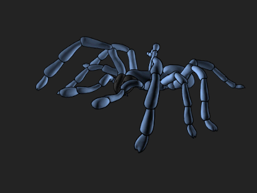
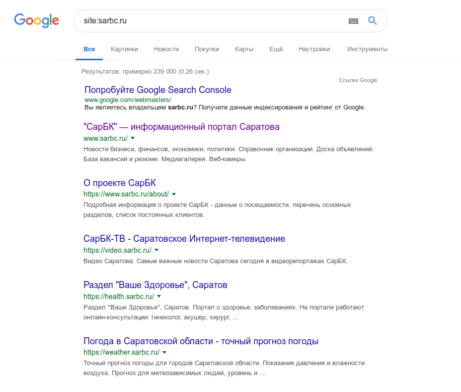

Вы разработали красивый сайт. Вложили кучу сил в контент, проработали дизайн и получили отзывы от первых пользователей. Самое время показать миру свою работу. И как только вы опубликуете сайт, контент сразу же появится в Google, так?

**Не совсем**. Прежде, чем сайт появится в результатах поиска, Google должен «проиндексировать» содержимое. Это происходит автоматически на протяжении дней или недель, но если вы владелец сайта, можно *вручную* отправить сайт гуглу и ускорить этот процесс.

Есть **два способа, как можно это сделать**. Но сначала, давайте кратко рассмотрим, как гугл сканирует и индексирует ваш контент.

## Как Google находит ваш контент

Google, как они сами говорят, использует огромное количество компьютеров для сканирования миллиардов страниц в интернете. Робот, называемый Googlebot, начинает со списка web-страниц, которых он собрал во время предыдущих сканирований. К ним добавляются страницы, указанные в картах сайта в [Google Search Console](https://www.google.com/webmasters/tools/home?hl=ru). Во время процесса сканирования, Googlebot - также известный как «паук» - ищет новые сайты, обновления существующих страниц и битые ссылки.

Если в карте сайта есть новые страницы, Google обнаружит их и просканирует содержимое, затем потенциально отобразит страницу в результатах поиска на основе оценки по более чем 200 критериям.

Как только процесс сканирования завершиться, все результаты попадут в индекс гугла. Любые новые сайты или обновленный контент будут обозначены соответственно. Во время обработки результатов, Google смотрит на информацию на вашей странице, такую как заголовок, meta description, alt-текст картинок и т.д. Если у вас динамический контент на странице, Googlebot может не прочесть его, тогда он просканирует текстовую версию. 

В итоге, вам возможно никогда не придётся добавлять сайт в Google, так как он будет найден автоматически. Недостаток такого подхода в том, что вы зависите от расписания гугла, он вас проиндексирует когда ему самому будет удобно. Что может случиться не так быстро, как вы этого хотите.

**Хотите проверить, есть ли определенный сайт в Google?** Просто наберите в гугле "Site:ИмяСайта.ru" Например, вот что показано по запросу Sarbc.ru:

**Если содержимое сайта ещё не проиндексированно**, Google сообщит, что поиск не дал результатов.

**Если результатов нет**, следующим шагом должно быть создание карты сайта, которую затем можно отправить в Google.

 
