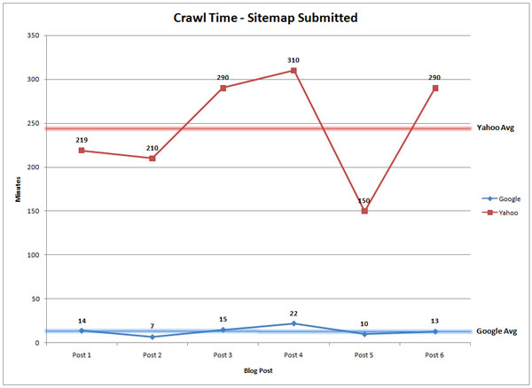

Вы разработали красивый сайт. Вложили кучу сил в контент, проработали дизайн и получили отзывы от первых пользователей. Самое время показать миру свою работу. И как только вы опубликуете сайт, контент сразу же появится в Google, так?

**Не совсем**. Прежде, чем сайт появится в результатах поиска, Google должен «проиндексировать» содержимое. Это происходит автоматически на протяжении дней или недель, но если вы владелец сайта, можно *вручную* отправить сайт гуглу и ускорить этот процесс.

Есть **два способа, как можно это сделать**. Но сначала, давайте кратко рассмотрим, как гугл сканирует и индексирует ваш контент.

## Как Google находит ваш контент

Google, как они сами говорят, использует огромное количество компьютеров для сканирования миллиардов страниц в интернете. Робот, называемый Googlebot, начинает со списка web-страниц, которых он собрал во время предыдущих сканирований. К ним добавляются страницы, указанные в картах сайта в [Google Search Console](https://www.google.com/webmasters/tools/home?hl=ru). Во время процесса сканирования, Googlebot - также известный как «паук» - ищет новые сайты, обновления существующих страниц и битые ссылки.

Если в карте сайта есть новые страницы, Google обнаружит их и просканирует содержимое, затем потенциально отобразит страницу в результатах поиска на основе оценки по более чем 200 критериям.

Как только процесс сканирования завершиться, все результаты попадут в индекс гугла. Любые новые сайты или обновленный контент будут помечены соответственно. Во время обработки результатов, Google смотрит на информацию на вашей странице, такую как заголовок, meta description, alt-текст картинок и т.д. Если у вас динамический контент на странице, Googlebot может не прочесть его, тогда он просканирует текстовую версию. 

В итоге, вам возможно никогда не придётся добавлять сайт в Google, так как он найдется автоматически. Недостаток такого подхода в том, что вы зависите от расписания гугла, он вас проиндексирует когда ему самому будет удобно. Что может случиться не так быстро, как вы этого хотите.

**Хотите проверить, есть ли определенный сайт в Google?** Просто наберите в гугле "Site:ИмяСайта.ru" Например, вот что показано по запросу Sarbc.ru:

**Если содержимое сайта ещё не проиндексированно**, Google сообщит, что поиск не дал результатов.

**Если результатов нет**, следующим шагом должно быть создание карты сайта, которую затем можно отправить в Google.

## Сколько времени требуется Google, чтобы проиндексировать контент?

Согласно [статье в Moz](https://blog.hubspot.com/marketing/submit-website-google), когда контент публикуется без отправки обновленной карты сайта, Google требуется 1.375 минут, чтобы обнаружить обновление. В то время как Yahoo — 1.773 минут, данные по Яндексу к сожалению отсутствуют. Чтобы понимать, это примерно целый день только чтобы проиндексировать ваш контент.

С другой стороны, если вы запускаете новый вебсайт или добавляете новые страницы на существующем домене, стоит отправить обновленную карту сайта. Согласно тому же исследованию, Генри обнаружил, что после отправки обновленной карты сайта, бот в среднем посещает страницу через 14 минут (по сравнению с Yahoo! - 245 минут). Другими словами, новая страница начинает генерировать траффик и конверсии в тот же день.    

## Как добавить мой сайт в Google?

Чтобы добавить ваш сайт в Google, вы можете либо отправить в Google файл Sitemap, либо отправить запрос на индексирование для желаемого URL через функцию «*Просмотреть как Googlebot*». Оба варианта требуют регистрации владельцев сайта в Google Search Console.

Вот специфика каждого варианта:

### Если у вас новый вебсайт...

Если вы запустили вебсайт в первый раз, нужно во-первых подтвердить владение вебсайтом в Google Search Console. Затем, отправьте [ссылку сюда](https://www.google.com/webmasters/tools/submit-url) — выберите вариант "*отправьте в Google файл Sitemap*" как только откроется страница. 

### Если у вас существующий сайт и вы добавили новых страницы...

С уже существующим доменом всё равно можно отправить новые страницы на индексацию и ранжирование их соответственно. Раньше кто угодно мог отправить страницу на индексирование, независимо от того, являлся ли он владельцем или нет. Сейчас, так же как и с запуском нового вебсайта, вам придется подтвердить права на ресурс чтобы гугл переиндексировал.

Если вы владеете сайтом, можно сделать несколько вещей:

### Отправить обновленный Sitemap

Во-первых, вы можете отослать файл Sitemap, чтобы убедиться что Google получает новый контент настолько быстро, насколько возможно. Чтобы отправить файл, войдите в Google Search Console и выберите "добавить ресурс".

Как только вы это сделаете, далее из панели управления можно будет отправить файл Sitemap.

