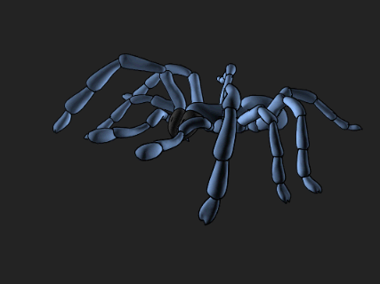
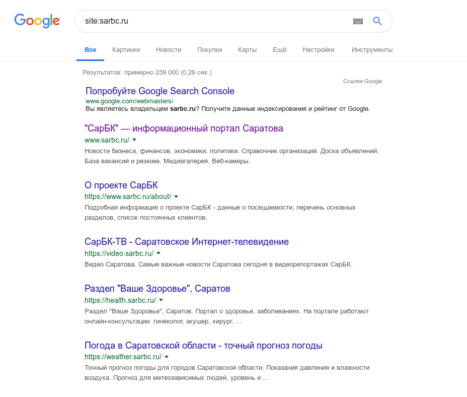
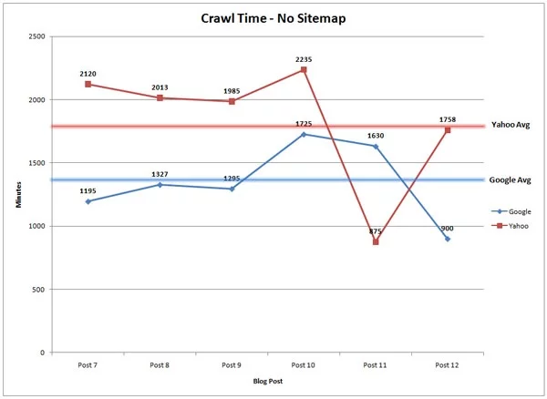
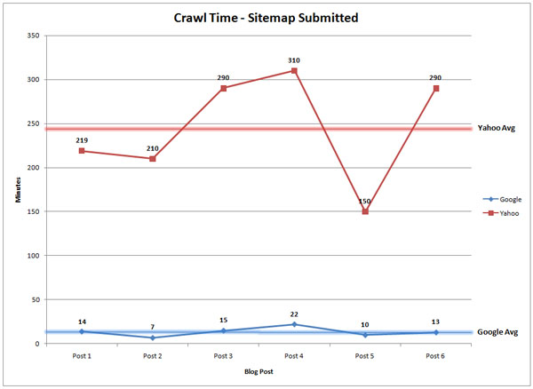
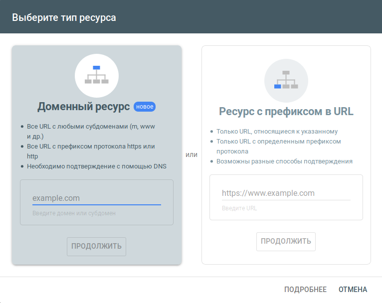
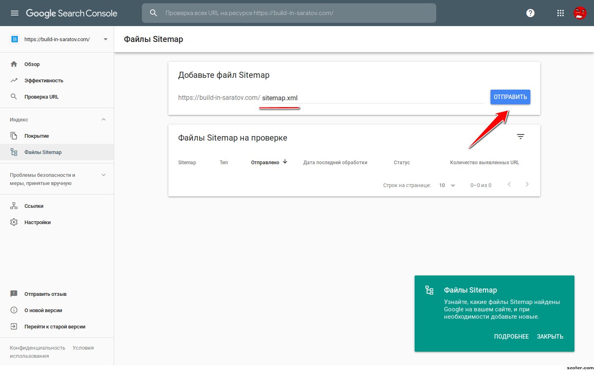

Вы разработали красивый сайт. Вложили кучу сил в контент, проработали дизайн и получили отзывы от первых пользователей. Самое время показать миру свою работу. И как только вы опубликуете сайт, контент сразу же появится в Google, так?

**Не совсем**. Прежде, чем сайт появится в результатах поиска, Google должен «проиндексировать» содержимое. Это происходит автоматически на протяжении дней или недель, но если вы владелец сайта, можно *вручную* отправить сайт гуглу и ускорить этот процесс.

Есть **два способа, как можно это сделать**. Но сначала, давайте кратко рассмотрим, как гугл сканирует и индексирует ваш контент.

## Как Google находит ваш контент

Google использует огромное количество компьютеров для сканирования миллиардов страниц в интернете. Робот, называемый Googlebot, начинает со списка web-страниц, которых он собрал во время предыдущих сканирований. К ним добавляются страницы, указанные в картах сайта в [Google Search Console](https://search.google.com/search-console?hl=ru). Во время процесса сканирования, Googlebot - также известный как «паук» - ищет новые сайты, обновления существующих страниц и битые ссылки.

Если в карте сайта есть новые страницы, Google обнаружит их и просканирует содержимое, затем потенциально отобразит страницу в результатах поиска на основе оценки по более чем 200 критериям.

Как только процесс сканирования завершиться, все результаты попадут в индекс гугла. Любые новые сайты или обновленный контент будут помечены соответственно. Во время обработки результатов, Google смотрит на информацию на вашей странице, такую как заголовок, meta description, alt-текст картинок и т.д. Если у вас динамический контент на странице, Googlebot может не прочесть его, тогда он просканирует текстовую версию. 

В итоге, вам возможно никогда не придётся добавлять сайт в Google, так как он найдется автоматически. Недостаток такого подхода в том, что вы зависите от расписания гугла, он вас проиндексирует когда ему самому будет удобно. Что может случиться не так быстро, как вы этого хотите.

**Хотите проверить, есть ли определенный сайт в Google?** Просто наберите в гугле "Site:ИмяСайта.ru" Например, вот что показано по запросу Sarbc.ru:

**Если содержимое сайта ещё не проиндексированно**, Google сообщит, что поиск не дал результатов.

**Если результатов нет**, следующим шагом должно быть создание карты сайта, которую затем можно отправить в Google.

## Сколько времени требуется Google, чтобы проиндексировать контент?

Согласно [статье в Moz](https://blog.hubspot.com/marketing/submit-website-google), когда контент публикуется без отправки обновленной карты сайта, Google требуется 1.375 минут, чтобы обнаружить обновление. В то время как Yahoo — 1.773 минут, данные по Яндексу к сожалению отсутствуют. Чтобы понимать, это примерно целый день только чтобы проиндексировать ваш контент.

С другой стороны, если вы запускаете новый вебсайт или добавляете новые страницы на существующем домене, стоит отправить обновленную карту сайта. Согласно тому же исследованию, после отправки обновленной карты сайта, бот в среднем посещает страницу через 14 минут (по сравнению с Yahoo! - 245 минут). Другими словами, новая страница начинает генерировать траффик и конверсии в тот же день.    

## Как добавить мой сайт в Google?

Чтобы добавить ваш сайт в Google, вы можете либо отправить в Google файл Sitemap, либо отправить запрос на индексирование желаемого URL через функцию «*Проверить URL*». Оба варианта требуют регистрации владельцев сайта в Google Search Console.

Для этого войдите в [панель управления](https://search.google.com/search-console?hl=ru) и выберите «Добавить ресурс». Появится окно с предложением выбрать тип ресурса и ввести домен.

Вот специфика каждого варианта:

### Если у вас новый вебсайт...

Если вы запустили вебсайт в первый раз, нужно подтвердить владение вебсайтом в Google Search Console. Я это обычно делаю через код Google Analytics. Затем, выберите пункт «*Файлы Sitemap*» на левой панели управления. На открывшейся странице потребуется указать путь к Sitemap.

### Если у вас существующий сайт и вы добавили новых страницы...

Раньше кто угодно мог отправить страницы на индексацию, независимо от того, являлся ли он владельцем или нет. Сейчас, так же как и с запуском нового вебсайта, вам придется подтвердить права на ресурс чтобы гугл переиндексировал.

Если вы владеете сайтом, можно сделать двумя способами:

1. ### Отправить Sitemap

<u>Смотри выше</u>. Обычно, файл Sitemap генерируется плагином автоматически и Google получит новые страницы практически сразу же. Это автоматический способ, дополнительных действий в этом случае не требуется.  

2. ### Проверить URL

Ручной способ. Как владелец сайта, вы можете использовать этот инструмент чтобы переиндексировать отдельные URL'ы. Чтобы это сделать, войдите в Google Search Console, в самом верху находится поле ввода URL для проверки. Просто введите адрес вашего сайта или адрес страницы и Google сразу же его проиндексирует.    

Вот собственно и всё, не забывайте периодически индексировать ваши сайты. Желаю вам успехов в сайтостроении и высокой посещаемости 😀 
