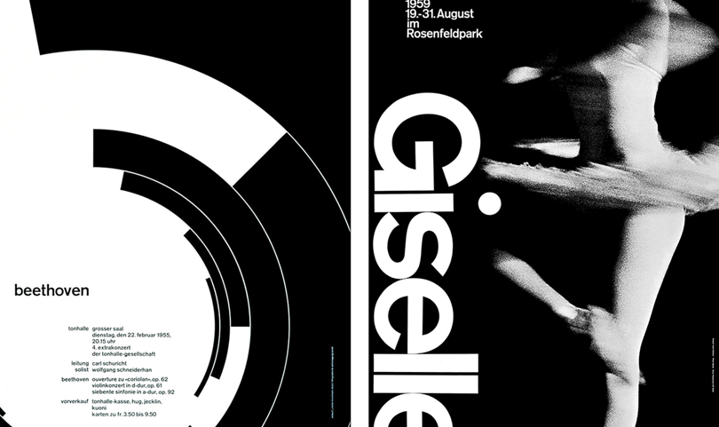
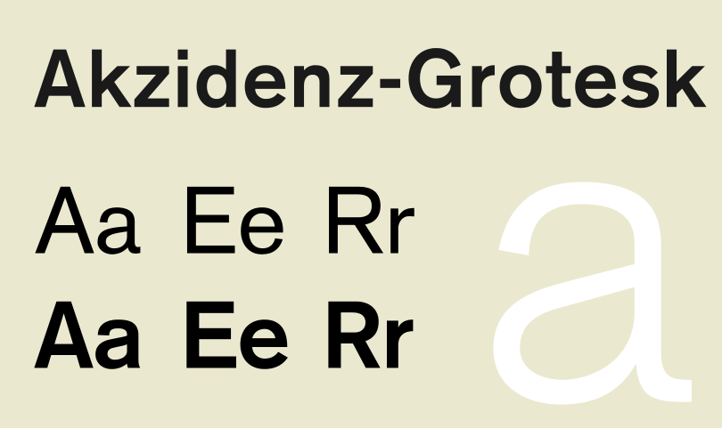

**Швейцарский стиль отвергает декоративные элементы, стремится к объективности и четкой коммуникации. Как его можно применить к веб-дизайну?**

Простота, объективность и читабельность. Это были главными идеями швейцарского стиля.

Прошло 70 лет с тех пор, как швейцарский стиль завоевал мир графического дизайна. Но актуальны ли эти принципы на сегодняшний день? И можем ли мы их использовать для создания сайтов и интерфейсов?

Давайте выясним.

## Что такое швейцарский стиль?

Швейцарский стиль или международный стиль, относится к движению, которое зародилось в России, Нидерландах и Германии во время 1920-х и 30-х годов. Затем дизайнеры возглавили движение в 1950-х годах в Швейцарии.

Швейцарский стиль — это модернизм. Это кульминация русского конструктивизма, искусств и ремесел, фотографии, [Де Стейл](https://ru.wikipedia.org/wiki/%D0%94%D0%B5_%D0%A1%D1%82%D0%B5%D0%B9%D0%BB) и [Баухауса](https://ru.wikipedia.org/wiki/%D0%91%D0%B0%D1%83%D1%85%D0%B0%D1%83%D1%81). Вы можете определить швейцарский стиль по смелым заголовкам, яркой композии и минималистичному подходу.

Ричард Холлис, автор [Swiss Graphic Design](https://yalebooks.yale.edu/book/9780300106763/swiss-graphic-design), отмечает что Швейцария, известная своими навыками в промышленности, а именно, в фармацевтике и машиностроении обладала так же сильными навыками в графическом дизайне. Они так же выпускали рекламную и техническую литературу.    

Пионеры швейцарского стиля видели дизайн как часть промышленного производства и отчаянно искали средства визуальной коммуникации.

 

Выбор типографики, в частности, был промышленным. Шрифт XIX века Akzidenz-Grotesk оказал большое влияние на швейцарский стиль.

Как шрифт, он неукрашенный, универсальный и функциональный — всё, что нравится модернистам в шрифте. Он вдохновил знаменитый шрифт *Helvetica*. Изначально разрабатывался как текстовый шрифт. Предназначеный для чтения, он использовался на вывесках Нью-Йоркского метро в семидесятых, до того как Helvetica заняла его место.   

Шрифт использовался в научных публикациях за свой чистый вид, что хорошо подходит веб-сайтам. Известный блогер Джеремия Шоаф, человек, стоящий за [Typewolf](https://www.typewolf.com/about), высказался о [Akzidenz-Grotesk](https://www.typewolf.com/site-of-the-day/fonts/akzidenz-grotesk):

> “Рад видеть, что Akzidenz Grotesk используется в интернете вместо Helvetica, потому что он сразу дает дизайну отличительный вид.”

Кроме графического дизайна и типографики, швейцарский стиль оказал влияние также на архитектуру, живопись и скульптуру. Например, [Павильон Германии (Барселона)](https://ru.wikipedia.org/wiki/%D0%9F%D0%B0%D0%B2%D0%B8%D0%BB%D1%8C%D0%BE%D0%BD_%D0%93%D0%B5%D1%80%D0%BC%D0%B0%D0%BD%D0%B8%D0%B8_(%D0%91%D0%B0%D1%80%D1%81%D0%B5%D0%BB%D0%BE%D0%BD%D0%B0)). Он был построен в 1929 и являлся примером модернистского подхода.

Так что же характеризует швейцарский стиль?

## Характеристики и принципы швейцарского стиля

Швейцарский стиль состоит из различных компонентов, но в частности он включает в себя:

- Сетки
- Асимметричное расположение
- Sans-serif типографика
- Точность
- Геометрическая абстракция
- Простота
- Объективность
- Фотография 

Как говориться в мантре Баухауса: *форма следует за функцией*. Это делает швейцарский стиль прагматичным и продуманным.

Этот подход также не касается вопросов красоты. Красота заключается в функциональности дизайна, он намеренно минималистичный и голый. Идея заключалась в том, чтобы сделать дизайн невидимым, подавить субъективность дизайнера и позволить содержанию говорить самому за себя.

UX-дизайнерам стоит использовать аналогичный подход при проектировании. Дизайн делается не для вас, так что не стоит увлекаться. Это касается всех аспектов. UX-писателям не стоит привязываться к словам, так же, как и дизайнеры не должны привязываться к интерфейсам. 

## Веб-дизайн в Швейцарском стиле

Швейцарский стиль может использоваться не только в постерах и другом графическом дизайне. Он также может использоваться в веб-дизайне и UX дизайне. Все характеристики из списка выше могут легко быть применены к вебсайтам.

Диого Террор пишет в [Smashing Magazine](https://www.smashingmagazine.com/2009/07/lessons-from-swiss-style-graphic-design/), что швейцарский стиль подходит созданию дружественных интерфейсов.

Далее он говорит, что

> “Этот стиль графического дизайна родился в институциональном контексте. Большинство произведений данного движения представлены в виде плакатов, штампов, институциональной типографической идентичности, уличных знаках и т.д. В этом смысле, художники используют гораздо больше, чем просто директивная коммуникация. Они создают удобные интерфейсы.“

Но с чего же начать?
