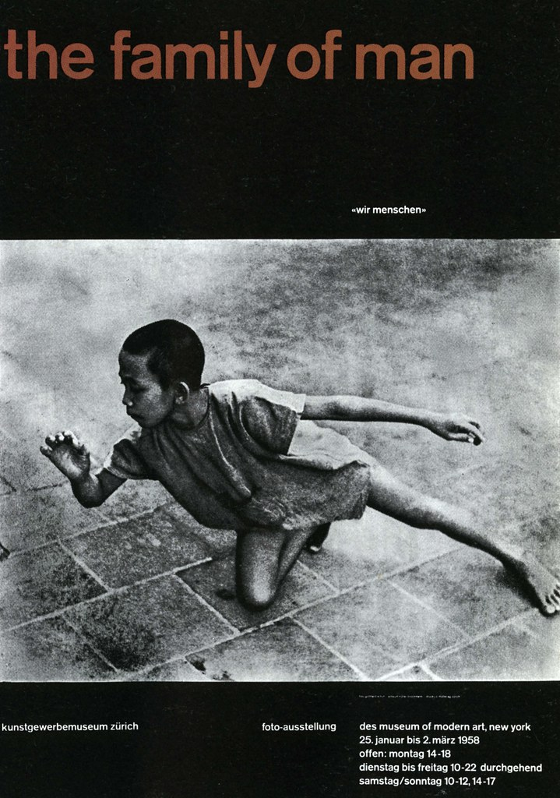

**Швейцарский стиль отвергает декоративные элементы, стремится к объективности и четкой коммуникации. Как его можно применить к веб-дизайну?**

Простота, объективность и читабельность. Они были главными идеями швейцарского стиля.

Прошло 70 лет с тех пор, как швейцарский стиль завоевал мир графического дизайна. Но актуальны ли эти принципы на сегодняшний день? И можем ли мы их использовать для создания сайтов и интерфейсов?

Давайте выясним.

## Что такое швейцарский стиль?

Швейцарский стиль или международный стиль, относится к движению, которое зародилось в России, Нидерландах и Германии во время 1920-х и 30-х годов. Затем дизайнеры возглавили движение в 1950-х годах в Швейцарии.

Швейцарский стиль — это модернизм. Это кульминация русского конструктивизма, искусств и ремесел, фотографии, [Де Стейл](https://ru.wikipedia.org/wiki/%D0%94%D0%B5_%D0%A1%D1%82%D0%B5%D0%B9%D0%BB) и [Баухауса](https://ru.wikipedia.org/wiki/%D0%91%D0%B0%D1%83%D1%85%D0%B0%D1%83%D1%81). Определяется швейцарский стиль по смелым заголовкам, яркой композиции и минималистскому подходу.

Ричард Холлис, автор [Swiss Graphic Design](https://yalebooks.yale.edu/book/9780300106763/swiss-graphic-design), отмечает что Швейцария, известная своими навыками в промышленности, а именно, в фармацевтике и машиностроении обладала такими же сильными навыками в графическом дизайне. Они выпускали рекламную и техническую литературу для химической промышленности, упаковку препаратов и многое другое.    

Пионеры швейцарского стиля видели дизайн как часть промышленного производства и отчаянно искали средства визуальной коммуникации.

 

Выбор типографики, в частности, был промышленным. Шрифт XIX века Akzidenz-Grotesk оказал большое влияние на швейцарский стиль и позже на его основе был создан Helvetica.

Неукрашенный, универсальный и функциональный шрифт — то, что нравится модернистам. Изначально разрабатывался как текстовый шрифт для чтения. Позже использовался на вывесках Нью-Йоркского метро в семидесятых, до того как Helvetica заняла его место.   

Шрифт использовался в научных публикациях за чистый вид, что подходит веб-сайтам. Известный блогер Джеремия Шоаф, человек, стоящий за [Typewolf](https://www.typewolf.com/about), высказался о [Akzidenz-Grotesk](https://www.typewolf.com/site-of-the-day/fonts/akzidenz-grotesk):

> “Рад видеть, что Akzidenz Grotesk используется в интернете вместо Helvetica, потому что он сразу придает дизайну отличительный вид.”

Кроме графического дизайна и типографики, швейцарский стиль оказал влияние также на архитектуру, живопись и скульптуру. Например, [Павильон Германии](https://ru.wikipedia.org/wiki/%D0%9F%D0%B0%D0%B2%D0%B8%D0%BB%D1%8C%D0%BE%D0%BD_%D0%93%D0%B5%D1%80%D0%BC%D0%B0%D0%BD%D0%B8%D0%B8_(%D0%91%D0%B0%D1%80%D1%81%D0%B5%D0%BB%D0%BE%D0%BD%D0%B0)) был построен в 1929 и являлся примером модернистского подхода.

Так что же характеризует швейцарский стиль?

## Характеристики и принципы швейцарского стиля

Швейцарский стиль состоит из множества компонентов, но в частности включает в себя:

- Сетки
- Асимметричное расположение
- Типографику без засечек (sans-serif)
- Точность
- Геометрические абстракции
- Простоту
- Объективность
- Фотографию 

Как говориться в мантре Баухауса: «*форма следует за функцией*». Это делает швейцарский стиль прагматичным и продуманным.

Этот подход также не касается вопросов красоты. Красота заключается в функциональности дизайна, он намеренно минималистичный и голый. Идея заключалась в том, чтобы сделать дизайн невидимым, подавить субъективность дизайнера и позволить содержанию говорить самому за себя.

Дизайнерам стоит использовать аналогичный подход при проектировании. Дизайн делается не для вас, так что не стоит увлекаться и привязываться к интерфейсам. 

## Веб-дизайн в Швейцарском стиле

Вот как Диого Террор описывает в [Smashing Magazine](https://www.smashingmagazine.com/2009/07/lessons-from-swiss-style-graphic-design/) предысторию швейцарского стиля:

> “Этот стиль графического дизайна родился в институциональном контексте. Большинство произведений данного движения представлены в виде плакатов, штампов, институциональной типографической идентичности, уличных знаках и т.д.“

Со временем стиль перекочевал из постеров и графического дизайна в интернет, где художники прикладывают усилия, чтобы содержание передавало сообщение в ясной, ненавязчивой форме. Все характеристики из списка выше могут легко быть применены и к вебсайтам.  

Но с чего же начать?

## Сетка как основа дизайна

Визуальные характеристики швейцарского стиля включают размещение элементов на математически построенной сетке для создания единой композиции. Сетка придает дизайну структуру, в которой можно «ограничить» элементы пользовательского интерфейса. 

Эта сетка должна представлять текстовую и визуальную информацию в четкой форме. Не важно, плакат ли это или интерфейс; сетка обеспечивает порядок. Шрифт должен быть без засечек и выровнен по левому краю. Конечным результатом будет ассиметричный дизайн. 

Джозеф Мюллер-Брокманн, один из пионеров швейцарского стиля и автор книги «[Система сеток в графическом дизайне](https://www.niggli.ch/en/grid-systems-in-graphic-design.html)», сказал о сетке:

> “Система сеток — это помощь, а не гарантия. Она допускает множество возможных применений и каждый дизайнер найдет решение, соответствующее его стилю. Но нужно научиться пользоваться сеткой; это искусство требует практики.“

Это жизненно важный инструмент, которым дизайнер может манипулировать в свою пользу при создании последовательных, удобных и доступных пользовательских интерфейсов.

Какими ещё способами могут дизайнеры привнести швейцарский стиль в веб-дизайн?

# 4 быстрых способов привнести швейцарский стиль в веб-дизайн

## Создайте ясность с меньшим количеством элементов

Швейцарский стиль характеризуется минимальным набором функциональных элементов на странице. У каждого элемента есть причина и эта философия напоминает минимализм. Но почему дизайн должен быть минималистичным? Когда вы уменьшаете дизайн сайта только до нужных элементов, вы создаете ясность.  

На фото приведен образец минималистичного дизайна. Крупный текст с ясным сообщением сразу приковывает внимание. И мы не переключаемся с одного на другое, потому что в дизайне всего несколько цветов: белый, темно-синий и зеленый. Из-за ограниченного количества UI-элементов, легко понять смысл веб-сайта. Загроможденный дизайн, напротив, вызывает путанницу и создает напряжение.

Дизайн — *это попытка донести сообщение*. И если сообщение не будет услышано из-за шума конкурирующих элементов, то у пользователя останется не очень приятное впечатление.

Джошуа Портер [пишет](http://bokardo.com/principles-of-user-interface-design/), что ясность является первостепенной задачей при дизайне интерфейсов. И чтобы быть эффективным, люди должны его осознавать, пользоваться им и понимать с какой задачей интерфейс им помогает справиться. 

По сути, ясность внушает доверие и стимулирует дальнейшее использование.

## Ограничьте выбор типографики

Выбор шрифта имеет решающее значение, когда речь идёт о веб-дизайне в швейцарском стиле (также известным как интернациональный типографический стиль). 

Шрифты являются основным элементом дизайна в швейцарском стиле. Посмотрите на любой плакат того времени и вы увидите большие, жирные шрифты, занимающие большую часть пространства.

Если хотите привнести швейцарский стиль в ваш веб-дизайн, пришло время выбросить Times New Roman, Garamond, Caslon и отдать предпочтение шрифтам без засечек. Этот выбор связан с тем, что шрифт без засечек подходит почти везде. Его можно использовать и в технической литературе, и для чего-то элегантного, высококлассного. Шрифт получил широкое распространение из-за того, что его можно использовать как в профессиональной среде, так и в неформальных дизайнах.     

Давайте посмотрим на сайт выше. Цель ясна: стать участником. Есть две причины, почему мы фокусируемся на ней. Первая - это размер. Шрифт крупный и сообщение ясное. Других конфликтующих сообщений нет. 

Другая причина — негативное пространство. Его очень много. Оно позволяет веб-сайту дышать, лучше передает сообщение и дает пользователю сосредоточиться на чем-то одном.

## Постройте типографическую иерархию

Типографическая иерархия — это способ структурировать содержимое вашего сайта путем расстановки приоритетов. Вначале важная информация, затем второстепенная.  

Чтобы достигнуть баланса в визуальной иерархии, нужно поработать над:

- Размером
- Цветом
- Толщиной
- Позицией
- Контрастом
- Кернингом

Примером такой иерархии служит первая страница газеты.

Заголовок, подзаголовок и основной текст — это способы создать иерархию. Газетный заголовок привлекает внимание (самая важная часть), подзаголовок дает дополнительную информацию (менее важно) и сам текст (наименее важно). И заголовок, и подзаголовок используются, чтобы побудить читателя прочесть текст. 

## Используйте фотографии, а не иллюстрации

Иллюстрация переживает бум в веб-дизайне. Компании всех видов используют их, чтобы добавить бренду шарм и индивидуальность.

Но в швейцарском стиле, всё построено на фотографии. Почему? В умах дизайнеров того времени фотография была способом представления реальности. Она более объективна, чем рисунок или иллюстрация (помните, эти парни любят объективность?)

 

Комбинация типографики и фотографии — центральная тема в швейцарском стиле. Они усиливают друг друга и служат средством визуальной коммуникации.

## Эпилог

Когда мы оглядываемся назад, на те движения которые сформировали мир и пытаемся по ним воссоздать собственный дизайн, конечный результат может быть неудачным. Потому что мы не жили в то время.

Но некоторые принципы, такие как внимание к типографике или тщательный выбор функциональных элементов стоит почерпнуть. Они будут полезны вашему дизайну.
