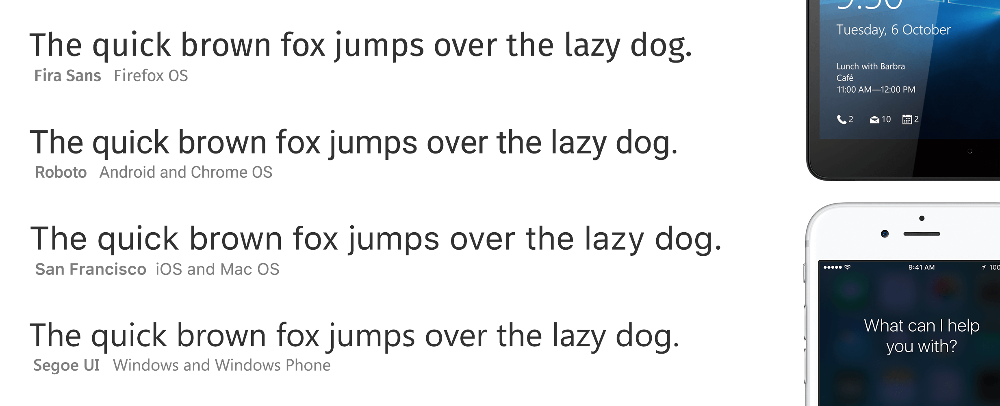

👋 Привет, в этой статье я попробую разобрать, как использовать системные шрифты на сайте и какие преимущества они дают.

---

## Зачем использовать системные шрифты?

Есть на то несколько причин.

### 1. Производительность

Самая главная причина использования системных шрифтов — это *производительность*. Шрифты, как правило, являются одним из самых тяжеловесных ресурсов на сайте. Но если шрифт уже доступен на пользовательском компьютере, это исключает необходимость его скачивания. Таким образом можно сэкономить несколько сотен килобайт при каждой загрузке страницы. Делая загрузку ощутимо быстрее.

### 2. Ощущение «родной» системы

Ещё одно преимущество системных шрифтов в том, что они гармонично вписываются в системное окружение и создают чувство схожести с родными приложениями. Но это больше полезно веб-приложениям, таким как Вконтакте или GitHub, чем веб-сайтам.    

### 3. Веб-сайтам не обязательно выглядеть везде одинаково

Хотя тот факт, что разные пользователи видят разные шрифты можно рассматривать как недостаток, в реальности это не важно. Главное чтобы сайт везде работал, а выглядеть он может по-разному. 

## Какие недостатки у системных шрифтов?

### 1. Конфликты имен

Кроме -apple-system и BlinkMacSystemFont, обычно мы перечисляем имена остальных шрифтов через запятую. Но если у пользователя установлен другой шрифт под тем же именем, будет неприятный конфуз. Как раз это и [случилось с Medium](https://medium.design/system-shock-6b1dc6d6596f) в первый же год после выхода на рынок.

### 2. Техническое обслуживание

Список шрифтов необходимо периодически обновлять, так как операционные системы со временем их меняют. К сожалению, пока только Apple предоставляет удобное сокращение -apple-system, означающее «просто дай мне системный шрифт». Вместо этого, нам пришлось бы указывать конкретные названия — San Francisco, Lucida Grande и т.д.



## Набор шрифтов

На данный момент нет универсального набора шрифтов, подходящего для каждой операционной системы. Хоть они отчасти пересекаются, но все же у каждой ОС они свои. Ниже перечислен список шрифтов и устройств, к которым они относятся:

| Название шрифта                    |                Устройство               |
|------------------------------------|:---------------------------------------:|
| **-apple-system** (San Francisco)      | iOS Safari, MacOS Safari, MacOS Firefox |
| **BlinkMacSystemFont** (San Francisco) | MacOS Chrome                            |
| **Segoe UI**                           | Windows                                 |
| **Roboto**                             | Android, Chrome OS                      |
| **Oxygen / Oxygen-Sans**               | KDE                                     |
| **Fira Sans**                          | Firefox OS                              |
| **Droid Sans**                         | Старые версии Android                   |
| **Ubuntu**                             | Ubuntu                                  |
| **Cantarell**                          | GNOME                                   |
| **Helvetica Neue**                     | MacOS версии < 10.11                    |
| **Arial**                              | Любое                                   |
| **sans-serif**                         | Любое                                   |

<mark>Примечание:</mark> *насколько мне известно, Oxygen-Sans не поддерживает русский язык, лучше его не использовать. Иначе русский текст будет некрасиво смотреться.* 

Порядок, в котором перечислены шрифты очень важен. Потому что всегда будет использован первый подходящий по имени шрифт. Значит и список нужно строить таким образом, чтобы подходил именно системный шрифт, а не любой, установленный у пользователя. 

Поэтому мы начинаем с наиболее конкретных шрифтов и двигаемся, перечисляя более редкие. Например, первый шрифт **-apple-system** определен всегда. Но его увидят только лишь пользователи MacOS и iOS устройств. Далее по списку идёт **Roboto**, он *скорее всего* установлен на Mac'ах, но о конфликте мы можем не беспокоиться так как более конкретный шрифт -apple-system уже указан первым.   

## Примеры

**Вконтакте**

```css
body {
  font-family: -apple-system,
                BlinkMacSystemFont,
                Roboto,
                Helvetica Neue,
                sans-serif;
}
```

**WordPress** 4.6

```css
body {
   font-family: -apple-system, 
                BlinkMacSystemFont, 
                "Segoe UI", 
                Roboto, 
                Oxygen-Sans, 
                Ubuntu, 
                Cantarell, 
                "Helvetica Neue", 
                sans-serif;
}
```

**Medium**

```css
body {
  font-family: -apple-system, 
               BlinkMacSystemFont, 
               "Segoe UI", 
               Roboto, 
               Oxygen,
               Ubuntu,
               Cantarell,
               "Open Sans",
               "Helvetica Neue", 
               sans-serif;
}
```

**Ghost**

```css
body {
  font-family: -apple-system, 
               BlinkMacSystemFont, 
               "Segoe UI", 
               Roboto, 
               Oxygen,
               Ubuntu,
               Cantarell,
               "Fira Sans",
               "Droid Sans",
               "Helvetica Neue", 
               sans-serif;
}
```

И наконец-таки, **Github**

```css
body {
  font-family: -apple-system, 
               BlinkMacSystemFont, 
               "Segoe UI", 
               Roboto, 
               Helvetica,
               Arial,
               sans-serif,
               "Apple Color Emoji",  /* Смайлики */
               "Segoe UI Emoji", /* Смайлики */
               "Segoe UI Symbol"; /* Смайлики */
}
```

## Рекомендуемый набор

Я думаю, лучше всего использовать список шрифтов от WordPress, он хорошо протестирован и используется большим количеством пользователей.

```css
body {
    font-family: -apple-system,
                 BlinkMacSystemFont,
                 "Segoe UI",
                 Roboto,
                 Ubuntu,
                 Cantarell,
                 "Helvetica Neue",
                 sans-serif;
}
```

Но вне зависимости от выбранного метода, я советую протестировать сайт в различных браузерах и операционных системах, чтобы убедиться что результат вас устраивает.
