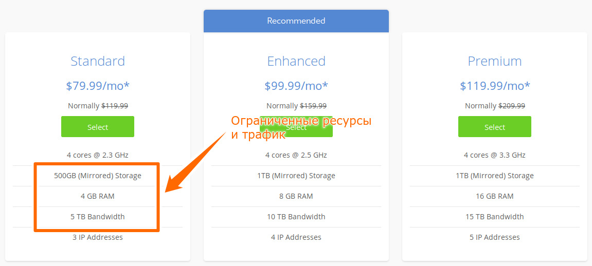
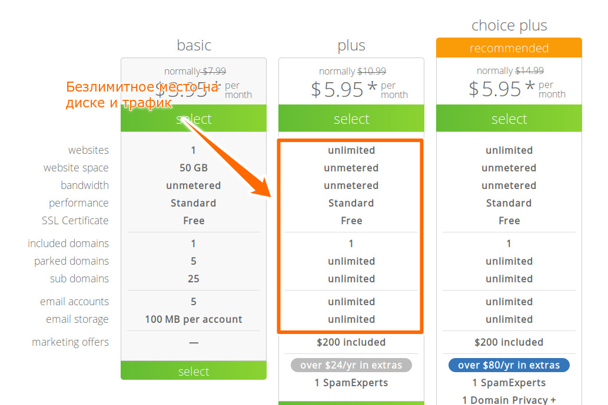

Вот такой вопрос люди задают:

> Кто-нибудь использовал этот хост? https://sherlockhost.ru/
> Чет обманом кажется безлимитный ЖД за 69р.
> Видел еще какой-то хост с синим дизайном, щас найти не смог, тоже цены на безлим ЖД мелкие, кидалово? 

Ответ: **да, это такой маркетинговый трюк**. И в этой статье я постараюсь рассказать подробно что представляет из себя подобный хостинг.

## Что такое безлимитный хостинг?

"Безлимитным" хостингом называют веб-хостинг, на котором не ограничено место на диске, нет ограничений на передачу данных, либо, в некоторых случаях позволено создавать неограниченное число поддоменов.

На практике это означает, что хостинг-провайдер предоставляет свободу размещать столько сайтов, сколько вы сами захотите по очень привлекательной цене (обычно менее $10/месяц).

### Слишком хорошо, чтобы быть правдой?

Возьмем к примеру, BlueHost – компания предоставляет широкий спектр услуг, от виртуального хостинга до VPS и выделенных серверов.

Если выбрать виртуальный хостинг на BlueHost (план "plus"), то можно размещать "безграничное" количество сайтов по цене $5.95/месяц. Но с другой стороны, придется заплатить минимум $79.99/месяц за выделенный сервер на том же BlueHost, который имеет "ограниченные" 500 GB места на диске, 4 GB RAM и 5 TB трафика.

Математика не сходится, не так ли?

Зачем кому-то платить $79.99 в месяц за хостинг с ограниченным трафиком, когда тот же самый провайдер предлагает безлимитный план за $5.45 в месяц?

Правда в том, что хостинг-компании находятся в своем мире и используют специфичную терминологию, непонятную обычному обывателю. Для обычного человека "безлимитный" означает именно это – отсутствие ограничений. Но в данном случае это не совсем так.

### Правда в том... что пределы есть всегда

Очнитесь люди! Мы живем в мире, имеющим свои пределы.
- Невозможно выделить неограниченное место для бесконечных серверов.
- Невозможно подключить неограниченное количество кабелей для передачи бесконечного количества данных вокруг земли.
- Невозможно нанять неограниченное количество рабочей силы для обслуживания серверов и сетей.

Неограниченный – не что иное, как воображаемый индустриальный термин, обильно посыпанный предостережениями (также известными как исключения).

### Зачем хостинги "дурят" народ?

Веб-хостинг – это крайне конкурентный бизнес. Хостинговые компании делают всё возможное, чтобы привлечь новых клиентов. Включая представление бесплатных услуг по миграции сайта, бесплатные кредиты Google Adwords, бесплатные SSL-сертификаты и т.д. Потому что в глазах потребителя "чем больше, тем лучше" и безлимитные тарифы стали популярной маркетинговой тактикой в середине 2000х (если я правильно припоминаю, BlueHost первыми начали её использовать).

## Как безлимитный хостинг работает?

Итак, мы ответили на вопрос "почему" – пришло время ответить на вопрос "как".

Если вы бегло прочли договор, обещающим вам луну и звезды за минимальную цену в 69 рублей/месяц и решили наконец-таки разместить свой вебсайт, то подумайте ешё раз.

Давайте вначале рассмотрим такой феномен как [оверселлинг](https://ru.wikipedia.org/wiki/%D0%9E%D0%B2%D0%B5%D1%80%D1%81%D0%B5%D0%BB%D0%BB%D0%B8%D0%BD%D0%B3).

### Что такое оверселлинг?

Оверселлинг происходит когда хостинг-компания продает больше ресурсов, чем физически может предоставить. Крупные хостинги обычно владеют непостижимыми объемами вычислительной мощности (пропускная способность, сервера и т.д.), которые никогда не смогут быть использованны лишь одним сайтом.

В то же время, большей части веб-сайтов нужно немного ресурсов для ежедневной работы. Видя, что большинство ресурсов серверов остаются невостребованными, хостинг-компании (предоставляющие безлимитный хостинг) просто перепродают неиспользованные мощности (ака оверселлинг).

### Безлимитный хостинг работает... пока вы не злоупотребляете

Но вернемся к теме – как работает безлимитный хостинг.

Представьте себе отель со шведским столом, вы приходите туда. Но на двери висит табличка "только люди весом < 70кг". В этом вся соль.

Это же самое относиться и к многим безлимитным тарифам – вы можете размещать неограниченное количество веб-сайтов и занимать неограниченное место на диске до тех пор пока соблюдены условия А и Б.

Проблема в том, что эти условия редко указываются в рекламе на сайте. Сама реклама продолжает твердить, что тариф безлимитный. Обычно это указывается в договоре мелким шрифтом, где указаны миллион и одно ограничение.

### Ограничения на безлимитных хостингах

Возьмем к примеру тот самый SherlockHost.

Практически каждый хостинг-провайдер имеет подобные ограничения для контроля своих пользователей. Эти ограничения могут быть в форме пределов использования памяти, CPU, inodes, максимального количества баз данных, количества MySQL-соединений или даже ограничений на FTP-загрузки.

Как только ваш сайт достигнет красной зоны, возможно два варианта развития событий – хостер блокирует ваш сайт, либо хостер начисляет дополнительные пени (а они уж начислят, ох как начислят!).

Вот так работает "безлимитный хостинг".   

## Всегда ли безлимитный хостинг зло?

Можно поспорить, что оверселлинг и безлимитные планы неэтичны. Однако это не означает, что указанная компания является явным злом.

С одной стороны, благодаря оверселлингу мы имеем супердешевый хостинг (иногда по 40-60 рублей в месяц).

А с другой, переход на "безлимит" – это всегда сложное бизнес-решение для компаний. Например, когда Hostgator вводил безлимитные планы, они потратили более года на подготовку (включая найм рабочей силы, а также инвестии в новое оборудование). Хоть сейчас они и ввели их, но все же их сервера остаются надежными и эффективными, с относительно вменяемой поддержкой.

## Заключение

В конце хочу посоветовать не спешить с выбором. Со временем оборудование дешевеет и сейчас каждая вторая компания предлагает всё то же безлимитное дерьмо, что и другие.    

И как мне кажется, на хостинге экономить не стоит. Ведь вы вкладываете силы и средства в разработку и продвижение сайта. Представьте, что ваш сайт в один прекрасный момент удаляют "без объяснения причин" из-за того, что он потребляет слишком много ресурсов.

Ну а если решите всё же остановиться на безлимитном, попробуйте следующее:
- Протестируйте хостинг сами, зарегистрируйтесь и проследите насколько быстро он работает. Если не понравится – отмените пробный период и попросите вернуть деньги.
- Почитайте отзывы от реальных пользователей, кто уже пользовался данным хостингом.

### TL;DR

Основные тезисы статьи:
- Безлимитный хостинг невозможен, лимиты есть всегда;
- Безлимитный – это маркетинговый трюк для привлечения новых клиентов;
- Такие низкие цены получаются благодаря оверселлингу;
- Будьте внимательны к деталям (условия договора, наличие техподдержки, послепродажное обслуживание и т.д.);
