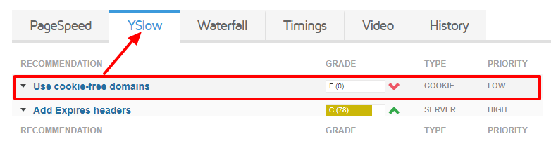

Предположим, вы хотите дать короткое и запоминающееся имя вашему магазину. Скажем, **myshop.ru** вместо **www.myshop.ru**. И тут вы себя спрашиваете, какой URL указывать в rel=«canonical», myshop.ru или www.myshop.ru? Обязательно ли использовать префикс www для имени сайта?  

Строго говоря, не обязательно. Для небольших малопосещаемых сайтов не имеет большого значения, как вы его назовете. Это просто давняя неформальная традиция давать префиксы доменным именам в зависимости от их функционального назначения. Например, FTP-сервер называть ```ftp.example.com```, почтовый сервер ```mail.example.com``` и так далее. Так легко отличить DNS-сервер от почтового или SSH-сервера. Доменные имена без префиксов называются **голыми доменами**.

Но что если ваш сайт начал расти? Как только у вас начали появляться поддомены, вот здесь-то и могут начаться неприятности. Давайте рассмотрим основные технические причины добавлять префикс www.

---

## Причина 1: Стабильность работы

Когда вы регистрируете доменное имя, регистратор вносит по меньшей мере две записи в DNS. **A-запись** указывает адрес, куда должен ссылаться домен. Обычно это хостинг-сервер на котором находится ваш сайт. И **CNAME-запись**, то есть синоним. Обычно это тоже самое имя сайта, только с префиксом www.  

У "голых доменов" CNAME отсутствует. Основным недостатком A-записей является то, что они жестко привязаны к адресу хостинг-сервера. Если не дай бог произошла DDoS-атака или сервер не справился с наплывом посетителей, то и сайт тоже перестает работать. В CNAME же не требуется жестко указывать один-единственный IP-адрес, вместо этого можно указать набор IP-адресов, связанных с вашим доменом и менять их на лету.

Таким образом, обеспечивается *стабильность работы сайта*. Если у вас большой поток посетителей и главный сервер не справился с нагрузкой, то посетителя перенаправит на запасной сервер (указанный в CNAME).

## Причина 2: Куки

Куки — это небольшой фрагмент данных, который храниться на компьютере пользователя. Благодаря им, вам не приходится каждый раз набирать имя пользователя и пароль, чтобы войти в учетную запись.

Когда вы набираете адрес сайта, браузер автоматически посылает их в заголовке запроса. Но он также **отправляет их и всем поддоменам**! Например, если у вас имя сайта **myshop.ru**, куки будут отправлены также и на blog.myshop.ru, marketplace.myshop.ru. А это уже потенциальная дырка в безопасности.

Пример, когда такое поведение нежелательно:

Вы размещаете статические файлы (изображения, стили, скрипты) на поддомене **static.myshop.ru**. Если передавать на него куки, это создаст ненужный трафик и снизит скорость загрузки. При проверке сайта на скорость тем же YSlow например, он выдаст предупреждение "используйте домены, свободные от cookie":

   

Если бы имя сайта было **www.myshop.ru**, такой проблемы не возникло бы. Так с одного поддомена на другой куки не передаются. С этой проблемой в свое время столкнулся Twitter, но они решили её покупкой отдельного домена twimg.com для всей статики. 

## Стоит ли переадресовывать голый домен на www?

Да.

Переадресация гарантирует, что посетитель попадёт на нужную страницу, даже если он набрал **myshop.ru**. И также гарантирует, что поисковики проиндексируют canonical URL'ы правильно.

Надеюсь, эта статья оказалась полезной 😀
